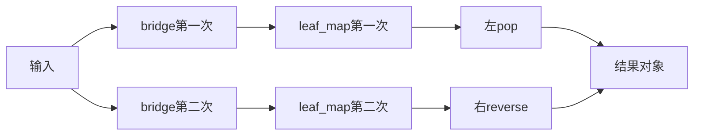
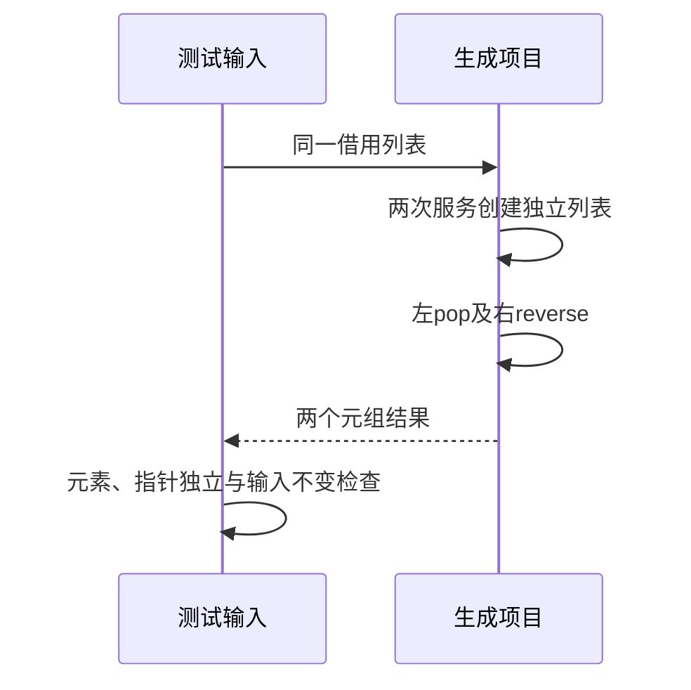

# RX服务新建列表独立消费执行验证

## Intent：最终目标

阶段281：真实执行两次跨两层服务的新建列表返回，检查独立存储、消费结果及分配失败。

## Data：可用证据

服务leaf调用map_values将输入每项加1，bridge透传新建列表；main调用bridge两次，左侧pop，右侧reverse。右侧反转若影响左侧结果即可暴露错误共享存储。

## Edges：边界与限制

输入最大值取maxU64-1，避免把加一溢出混入所有权验证。测试输入自行复制，与程序使用的故障注入allocator分离，确保OOM检查只作用于程序分配。只验证列表，不外推任意聚合。

## Answer：交付与成功标准

空、单元素、多元素、边界四组结果及逐分配点故障注入，输入成功/失败后都不变，非空剩余列表互不共享且不别名输入；完整RX运行套件通过。

## 实际结果

新增5项全部通过，完整test-rx-runtime构建58/58步骤80/80通过。多元素输入[1,3,8]得到左剩余[2,4]/弹出9、右反转[9,4,2]，空/单元素/边界同样符合预期。非空剩余列表指针彼此不同且不等于输入；所有元素深比较，正常及OOM返回后输入均未改变。

首次Return使用reverse().pop()不符合ZX契约：reverse返回[新列表,void]元组，不能直接对元组pop。保留原构建失败日志，将右侧改为直接reverse并检查其列表字段，独立存储验证目的保持不变。不是编译器问题，没有向实现会话发送消息。

格式及本次diff检查通过，源码草稿、最终日志和实现哈希保存。独立RX运行80、推断76；JSONL64,292和上游1,212不变。

## 自我批判

指针比较只作为额外证据，核心断言仍是右侧原地反转后左侧元素正确及输入不变；单纯指针不同不足以一般证明完全无重叠。本轮只覆盖四组列表及当前执行路径的分配失败，不是任意可变聚合的所有权证明。首次测试对返回契约判断失误已纠正，未将正确拒绝报告为实现缺陷。没有生产修改、全仓回归或UI验证。
