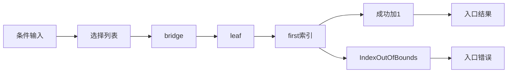
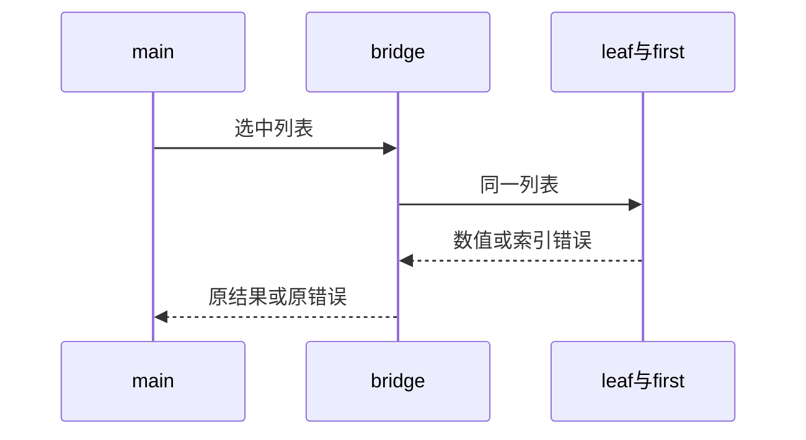

# RX服务条件实参与错误传播验证

## Intent：最终目标

阶段282：验证条件选择的列表经两层服务传入ZX索引函数，未选空列表不影响结果，选中空列表错误正确传播入口。

## Data：可用证据

main选择$in.left/right调用bridge，bridge调用leaf，leaf调用first.zx读取第0项；main对成功结果加1。项目生成程序实际运行，输出错误类型可直接观察。

## Edges：边界与限制

输入每项最大取maxU64-1保证末尾加一安全。错误检查只证明IndexOutOfBounds传播，不声称验证任意副作用的后续取消或异常栈信息。

## Answer：交付与成功标准

6场景覆盖未选空列表、选中空列表、两侧非空选择、零及最大安全值。成功值精确、错误类型精确，两侧输入成功/失败后均不变；完整RX运行套件通过。

## 实际结果

完整test-rx-runtime构建61/61步骤86/86通过，新增6项覆盖左右选中非空、左右选中空错误、零结果+1及最大安全结果+1。错误严格匹配IndexOutOfBounds；每次执行后比较left/right输入元素，包括失败分支。

受控error_service模式使用真实XML项目推导和生成程序，无手写替代执行路径。项目编译工具90行，仍负责固定fixture集合的推导与生成，不为行数机械拆分。格式及本次diff检查通过，源码草稿、日志、实现哈希保存。

独立RX运行86、推断76；JSONL与上游计数不变。没有实现问题，未发送通过消息。

## 自我批判

本例证明传给服务的是被选列表，未选空列表不会被索引；单凭此例不能证明访问未选字段本身从未求值，因为读取列表字段没有可观察副作用。错误值相同可证明原类型传播，不能证明所有后续副作用都被取消或诊断调用栈完整。已有单模块短路测试提供其他边界，本轮不将其重复计数。没有生产修改、全仓回归或UI验证。
