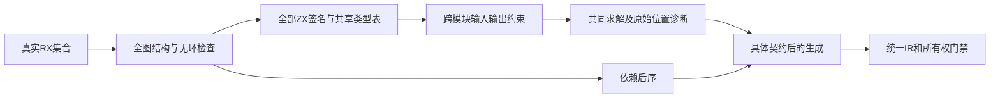
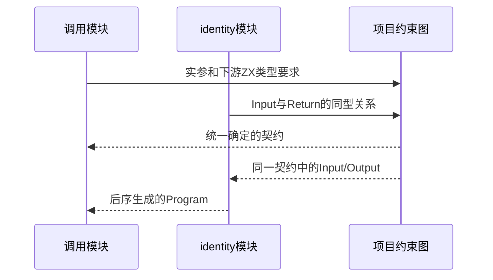

# RX 服务模块联结实施计划

## Intent：最终目标

完整连接 Call.service 的真实 RX 文件依赖与执行，不增加“子模块必须独立推导类型”的限制。一个模块文件形成一个一致的输入输出契约，允许合法共享依赖与重复调用，所有依赖必须无环。

## Data：可用证据

现有 module_graph 已遍历全部注册模块、未使用 Import 及嵌套 Call.service，模块根帧退出即得到依赖后序。modules.Result 当前只返回输入顺序的模块数据，不能直接提供生成次序。统一 RX Program 已能把另一个 Program 作为普通 callee 导入，函数、类型、原生编号与所有权门禁可复用。

现有 shared.rx 只有 Return $in，独立入口无法推导类型；但在完整项目中调用者可能提供约束。后序独立编译会错误拒绝这一合法场景，因此后序只能用于具体化之后的 lowering。

## Edges：边界与限制

不改变 validateModules.value.data 的输入顺序，不改变诊断 source_index 的对应关系。失败时不暴露部分有效的拓扑序。全部模块完成原有路径、存在性与环检查后，才进入语义阶段；不只检查当前运行分支。

共享类型表与名义类型来源只能追加，不能用旧子模块的类型前缀覆盖全局表。子 Program 以值副本交给 native 合并及函数编号映射，不原地修改共享子模块。

类型阶段必须区分相等约束和调用赋值约束：未知 service Input 后来变为 optional 时，不能提前把非 optional 实参硬统一成 optional。列表字面量在目标可能成为 tuple 时也不能过早固定为同质 list。跨文件的延迟约束必须保留来源，不能仅用相互重叠的本地 offset 来定位诊断。

未读 $in 不能立即强制定为 void：service 调用者可能提供了有类型的实参。只有全项目稳定后仍没有输入约束且输入未参与其他值关系时，才按无输入规则处理。每个模块一个契约不等于按调用点自动多态，冲突必须明确诊断。

不新增测试、不执行全量测试、不调用浏览器。先实现所需基础，再接通共享约束、后序 lowering 和真实 CLI 集合装载；未完成时不声称 service 可执行。

## Answer：交付与成功标准

提供经原有完整无环检查得到的 dependency_order，再实现项目级统一推导和 service 执行。成功标准包括真实多模块输入、调用者确定 identity 模块类型、共享依赖和重复调用，及循环依赖和不相容调用的明确拒绝。生成与用户文档同步最终能力。

## 实施与自我复核

先实现依赖顺序保留。项目共同推导、赋值约束、延迟序列形状与CLI集合联结尚未完成，不能用基础接口成功代替完整service实现。

### 已实现：保留完整依赖顺序

module_graph 在每个模块根帧退出时记录输入索引；此前的全部模块遍历、未使用 Import 与嵌套 Call.service 检查不变。modules.Result 和 text.Result 均新增默认空的 dependency_order。只有完整校验成功才返回顺序，value.data 与 source_index 继续保持输入顺序。

既有 `zig build test-rx --summary all` 定向回归为 3/3 步骤、39/39 通过，其中保留原有依赖图检查和分配失败覆盖。未新增测试、未运行全量测试。

通用 inspect-rx-order 工具从传入路径读取真实 XML 并输出原顺序与依赖顺序，没有内置示例路径或断言。检查器 3/3 构建成功；对既有 main、left、right、shared 示例输出 shared、left、right、main，原输入数组次序保持不变，DebugAllocator 未报告泄漏。示例含未使用 Import、Switch 分支中的 service 和共享子模块；该结果只验证结构图，不执行 Switch 或 Store。

### 下一阶段的实现约束

共享 Graph 必须先为所有模块登记 input/output Id，并保存源身份，再收集函数签名、调用、结果绑定与 Return 关系。所有约束稳定后才能具体化并按 dependency_order 生成 Program。

需要先解决两个既有单模块推断器没有遇到的边界：未知 service 目标的赋值关系不能提前当等式合并；未知上下文的数组字面量不能在目标之后才确定为 tuple 时已经丢失各元素约束。未读输入但被调用者传参的模块也不能提前归为 void。这些是完整自动推导的实现要求，不改成要求用户额外写类型声明。

### 延迟序列形状实施

新增序列构造关系，保留每个字面量的元素节点和结果节点。结果在目标尚未知时只标记为 sequence，不合并各元素；已确定 list 或 tuple 时逐元素传播所需类型。只有结构及可选包装约束稳定后，仍无目标的序列才按既有默认列表规则收束。相同类型变量上的多个字面量各自保留构造关系，不通过复制一次元素快照来丢失约束。

不提前调用 resolve，不改变正式 ZX 表达式编译与所有权门禁。列表默认、空列表无法推导元素、tuple 元素数量错误仍由统一约束检查处理。此项完成也不代表项目级 service 已接通。

### 延迟序列阶段结果与复核

已接入独立 sequences 实现。多个字面量即使共享结果类型节点，仍各自保留元素与原始位置，分别检查元素数量及类型。默认列表只选择没有被其他未决序列包住的根，每次默认后重新传播；对象、可选和容器中的嵌套关系同样纳入顺序判断。不可消解的递归构造明确拒绝。

在 packages/test 运行既有 `zig build test-rx-inference test-rx-runtime --summary all`，最终源码下 30/30 构建步骤、73/73 既有检查通过。未新增测试、未运行全量测试。该回归证明既有输入推导与执行样例未退化，未单独提供跨模块延迟 tuple 的运行证据；项目级 service 尚未接通，因此不能声称此特性已经端到端完成。

自我批判：序列默认阶段通过遍历构造关系选择外层，正确性不依赖源文件或登记顺序；大量嵌套字面量的扫描成本尚无性能数据。当前保持实现局部，后续若性能证据显示瓶颈再引入索引，避免现在增加同步维护结构。剩余关键工作是延迟赋值约束、跨文件来源映射与项目统一推导。
