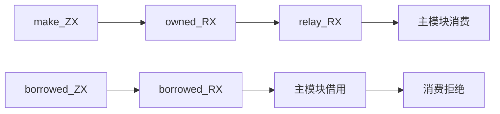
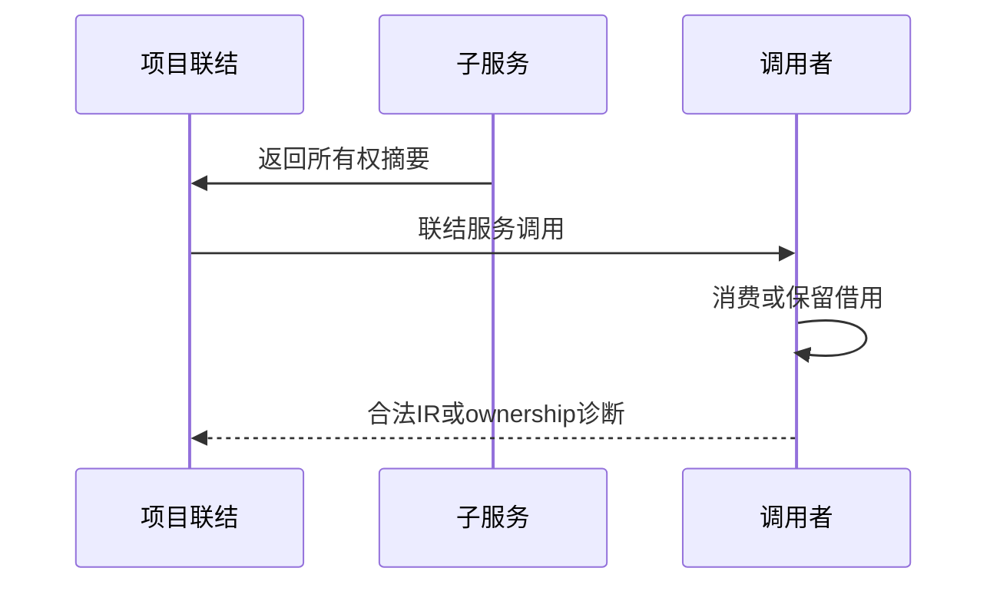

# RX服务返回所有权验证

## Intent：最终目标

阶段280：验证项目联结将服务返回的所有权摘要传播给调用者，新建列表可消费，借用列表不可消费。

## Data：可用证据

现有ZX make创建列表、borrowed透传列表；将它们分别包装成owned.rx/borrowed.rx，relay.rx再次转发owned服务。主模块使用Call.service接收结果并pop，与已通过的Call.fn边界对照。

## Edges：边界与限制

这里验证推断、全程序所有权检查及IR，不宣称列表生成代码已执行。注册集合含全部有具体ZX签名的服务，不引入未约束无关模块。

## Answer：交付与成功标准

6项正反对照：新建可消费、借用拒绝、两个独立新建结果可消费、同结果重复消费拒绝、借用别名发布后原owner消费拒绝、跨两层新建结果可消费。成功IR有效，拒绝ownership且定位main.rx；失败保留并通知实现会话。

## 实际结果

独立4/4步骤6/6通过，正式纳入project/ownership_test.zig并复用已有ownership fixtures。正式test-rx-inference构建4/4步骤76/76通过。三个合法路径均验证最终联结IR；三个拒绝路径均为ownership且path为main.rx。

新建返回在relay→owned两层调用后仍可消费；独立调用结果分别拥有所有权。同一结果重复消费、借用返回消费及发布别名后再消费原owner均准确拒绝。格式与本次diff检查通过，日志及验证后实现哈希保存。无实现问题，未发送通过消息。

独立RX推断76、运行75；JSONL与上游审阅未变化。

## 自我批判

所有权检查通过不是运行后列表值正确的证明，后续仍需生成执行和分配失败检查。本轮以固定u64列表验证返回摘要，不覆盖对象/元组/可选聚合和多分支返回的全部组合。所有拒绝均检查业务错误类别，未将一般type_mismatch或构建失败当成ownership成功。没有生产修改、全仓回归或UI验证。
