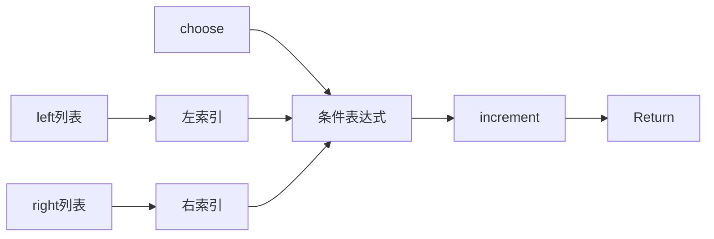
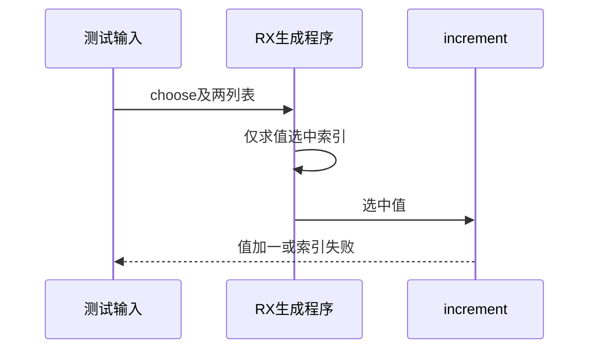

# RX条件参数短路执行验证

## Intent：最终目标

阶段253：验证RX Call.in条件表达式合并到整体Program后保持短路与选中错误传播。

## Data：可用证据

当前inference支持conditional，program.expression复制条件表达式结构。阶段251-252运行测试未对带失败分支的调用参数进行检查。

## Edges：边界与限制

测试的是单个Call.in中的ZX条件表达式，不是RX Switch标签执行。输入包含choose与两个列表，选中元素后传递increment，结果必须加一；不修改实现。

## Answer：交付与成功标准

六项真实执行覆盖两方向：未选中空列表成功、选中空列表失败、双方非空时正确选择。实际生成Zig运行必须保持IndexOutOfBounds传播与原始输入不变。

## 实际执行结果

新增六项，整组test-rx-runtime为21/21步骤、22/22通过。选择左值11且右空得到12；选择右值41且左空得到42；反向选择空列表的两个对照均IndexOutOfBounds。两列表非空时选择23/59分别得到24/60，证明选中值还经过increment调用。

所有场景保存输入列表快照，并在成功或预期错误后比较，未发生内容变更。既有16项运行测试随编译工具模式变动一并重跑通过。格式与本次README diff检查通过，源码、fixture、日志、构建及关键实现SHA归档。

独立RX运行测试增至22，自动契约仍30；JSONL64,145及Test2621,047保持不变。已向实现会话同步，无新缺陷。

## 自我批判

该组条件表达式处在调用参数中，不能推断RX Switch、Parallel或Task运行支持。输入列表只验证当前六场景的内容不变，不声明所有聚合输入的别名与生命周期安全。正反错误对照避免仅用成功分支误报短路；未执行全仓回归或改动生产实现。
