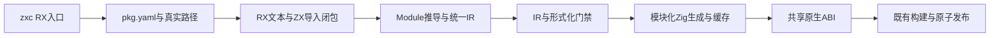
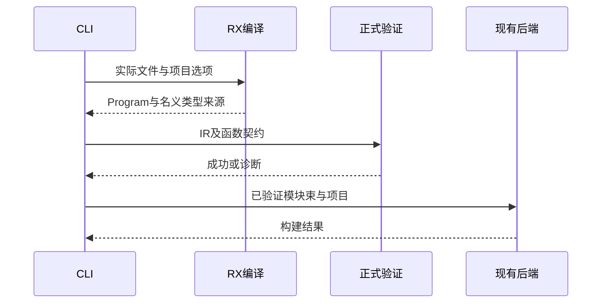

# RX 构建入口实施计划

## Intent：最终目标

将顺序 RX 模块接入正式 zxc 构建命令，复用现有 Zig 模块拆分、ABI、证明门禁、代码生成缓存与安全发布流程。所有参数来自真实文件、pkg.yaml 及既有项目解析，不使用示例专用路径。

## Data：可用证据

Contract.program 已具备可执行统一 IR，真实生成执行检查已通过。CLI 的 compile.run 目前仍只读取 ZX 导入闭包；rx/load 只为 check-rx 校验并丢弃 ZX 函数源。现有 build.run 接受 ModuleBundle、Loaded 项目和工具链，可直接复用。verified_compile 在分析后执行 IR/形式化验证，代码生成分包由 compiler 后端转交 genz。

## Edges：边界与限制

RX 入口只接受当前正式支持的顺序 Call.fn/Return，其余流程明确诊断。保持项目根及真实路径边界，使用同一个项目选项收集 ZX 函数闭包。形式化契约不得绕过证明进入模块生成；外部 ABI 沿用共享类型及名义来源。

实现时先接通 app 构建和源码生成；lib 发布的 RX 源归档、watch 的观察集合与 FPGA 入口需各自准确接入，不默默忽略模式参数。未完成模式明确报告边界。整体目标不因此缩小。

不新增测试、不跑全量测试、不调用浏览器；使用已有文件验证正式命令，独立测试交由另一会话。

## Answer：交付与成功标准

正式 zxc build function.rx --out 命令生成可运行应用；真实源码路径、输入输出及证明失败行为可审阅。公开使用文档记录命令与当前能力，按 feature 提交并推送。

## 实施与自我复核

已实现正式 RX 入口分派、项目与函数源码闭包装载、源码生成、app 构建及 watch。compiler 新增 emitProgramVerified/emitModulesVerified，和原有 ZX 路径共享 checkProgram 门禁；验证成功后才允许读取生成缓存或调用 genz。

独立只读复核发现并修复两处边界：在项目装载前登记缺失 RX 入口，保证 watch 可从入口不存在恢复；无 package scope 时对 ZX 导入闭包补充物理根校验，已声明依赖包仍沿既有 scope 规则处理。直接 Call.fn 的物理检查不会因其先被其他函数导入而跳过。

RX 语义推导当前仍重新执行；细粒度 Zig 生成缓存复用已有后端实现。fmt、独立 verify、fpga 和 lib 发布模式明确诊断，未悄悄忽略参数。自动构建的函数契约证明门禁仍生效。

实施期间收到 owned 跨 Call.out 消费误拒反馈，已优先单独修复并推送 ec9d33e；该修复不混同为 CLI 的能力变更。

### 当前验证

- 根目录 zig build：14/14 构建步骤成功，未运行全量测试。
- 正式 zxc build 已有 function.rx：成功构建，输入 41 输出 42。
- 同一应用再次构建：generated=0、reused=4、loaded=4，表明已有模块生成结果被复用。
- 正式 RX 源码输出命令成功生成 Zig。
- 显式指定不存在的求解器：非零退出，原有应用 SHA256 不变。此项仅证明失败不发布，不代表成功证明了某个业务契约。
- 独立临时目录复制原有示例运行 watch：缺失入口创建后恢复；依赖加一改为加二后输出从 42 变为 43，生成统计为 generated=1、reused=3；依赖出现名字错误后保留输出 43 的旧应用。

### 自我复核

实际证据来自正式 CLI 和既有业务示例，不是替代 AST 或手工生成固定输出。未新增测试、未调用浏览器。watch 恢复、原生 ABI、库发布与全部流程节点的证据分别计算，不能将本次普通函数样例扩大为全功能 RX 系统完成。

watch 名字错误修复后已恢复输出 42；验证用进程通过原 session 中断并确认退出 130。执行日志与源码 SHA256 记录在 RX构建入口/验证。公开 CLI、RX reference 和应用使用指导已同步能力边界。

独立测试会话另行复验所有权修复：RX 契约及生成执行合计 69 项通过，独立表达式相关 64 项通过。这些是另一会话的范围化报告，不作为本会话全量测试，也不替代当前 CLI 样例证据。
