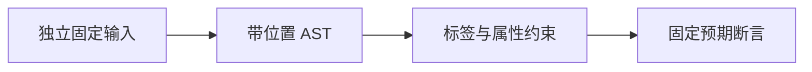

# RX 流程文本结构验证

## IDEA

- Intent：验证真实 XML 文本经过解析后，普通流程标签的结构契约仍得到执行。
- Data：当前 RX 公共标签、已有 AST 流程测试、真实文本测试入口；所有拒绝案例必须先成功解析 XML。
- Edges：单文件 Schema 验证，不证明函数存在、表达式类型、Store 联结或 RX Runtime 执行；不改变生产源码。
- Answer：独立命名 Zig 测试、构建登记、专项结果与自我批判。成功标准是正确的接受结果或准确诊断类别及属性。

## 执行计划

1. 在草稿目录编写真实文本用例与复用校验器。
2. 登记到现有 test-rx-text，执行全部文本专项。
3. 检查格式和 diff，更新覆盖清单与执行记录。

## 架构

## 数据流

## 执行结果

新增 30 个独立命名测试：28 个结构拒绝、1 个合法组合数据检查、1 个 CRLF 属性值诊断位置检查。拒绝覆盖调用目标互斥、必要属性、空属性、容器下界、非法嵌套、重复分支与 Store 别名、叶节点子元素及正文。

`zig build test-rx-text --summary all` 退出 0：9/9 步骤、39/39 测试通过。日志 `/tmp/zxc-rx-flow-text-final.log`。新增测试使用测试分配器，所有解析和校验结果释放；这不等于新增分配失败穷举。格式与 diff 检查通过，草稿与正式文件一致。无生产源码改动，无发现需通知实现会话的新缺陷。

本轮不新增 JSONL 登记或 Test262 上游审查，维持 57,745 与 328/53,597。最近完整根回归仍是阶段 90，本轮仅运行相关专项。

## 自我批判

- 相比已有合成 AST 测试，本轮价值是验证真实文本能够传递结构和位置，而非发现新的语言功能。
- 固定负例只证明对应约束，不能外推全标签、所有属性排列及深层组合均正确。
- 合法组合不检查函数解析、表达式、Store 值与宿主生命周期；相关能力需独立测试或等待实现。
- 为避免错误统计，28 个拒绝案例先断言 XML 解析成功，解析错误不能冒充 Schema 拒绝成功。
