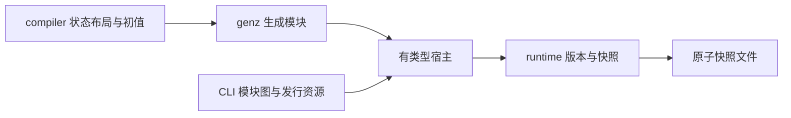
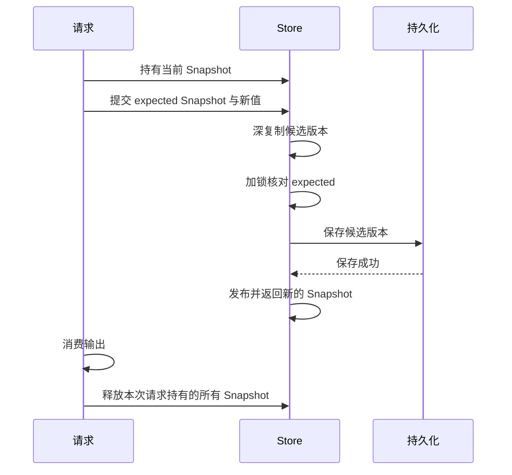

# RX 状态宿主实施计划

## Intent：最终目标

让原生 RX 应用自动初始化、持有和恢复 Store，按每个 Call 的边界提交，保证请求输入、旧快照和输出的有效存活期。完成后撤掉现有原生构建的明确拒绝分支。

## Data：可用证据

函数权限与真实 XML 调用已在 f755d85、2d5587d 接通。CLI runner 目前固定执行两参数 execute，ModuleBundle 已能承载具有独立依赖的源码模块。仓库没有 runtime 包；发行工具链使用内置压缩源码资源，新增运行时不能只在本地构建中注册。

## Edges：边界与限制

旧 Store 值可能仍由 ctx 或最终输出引用，提交后不能立即回收。状态版本必须拥有完整数据，不能保留请求 arena 中的嵌套指针。所有可能失败的分配、复制和持久化都应先完成，再发布内存中的新版本。显式 Snapshot 句柄持有版本；复制句柄时需要 retain，使用结束后释放。

定义中的 schema version 与每次提交的 revision 分开。并发提交应核对捕获的版本，不能仅递增计数便宣称支持冲突检测。磁盘恢复还需核对身份与类型；不能覆盖 Store 源文件或把不兼容快照静默重置。既有纯应用入口保持当前调用方式。

不新增测试用例，不运行全量测试。使用可审阅的实际程序与必要的既有专项验证；记录哪些边界已经执行、哪些仍在实施。

## Answer：职责与实施顺序

1. 新增 runtime 包，只依赖标准库，承载不可变版本、Snapshot、深复制及条件提交。编译器、XML 与业务字段不进入该包。
2. compiler 为每个物理 Object 生成独立初值模块并共享应用 ABI；genz 生成有类型的宿主，根槽位按物理身份匹配初值。初值修改只使相应生成单元失效。
3. 请求上下文持有访问过的版本，提交后更新稳定 getter 单元；释放顺序是消费输出、释放请求快照、释放 Store owner。版本提交与上下文保留所需空间须在发布前准备好。
4. 接入带身份、schema 与 revision 的原子快照保存和恢复，明确跨进程并发协议。失败不能损坏已提交状态。
5. CLI 选择 Store runner，注册宿主、初值和 runtime 依赖。发布压缩包携带 runtime 全部源码，watch 与构建摘要覆盖新增资源。

## 第一项交付边界

runtime 的条件提交 API 要验证具体版本节点身份，拒绝过期版本与其他 Store 的 Snapshot。持久化回调必须自行保证失败原子性；runtime 在回调成功之前不发布内存版本。本项不会单独宣称原生应用宿主或跨进程恢复已经完成。

## 第一项实施记录

新增 `packages/runtime` 独立 Zig 包。`store.zig` 管理 owner、Snapshot 与条件提交，`store/revision.zig` 管理版本 arena 和原子引用计数，`store/clone.zig` 按不可变值的类型结构递归复制数据。持久化采用调用方提供的 save 方法，不依赖 compiler、genz 或 CLI。

提交先复制候选值，再在锁内比较版本节点，最后保存并发布。旧版本由显式 Snapshot 保留，提交成功和释放 owner 都不会使仍被持有的数据失效。候选分配、锁获取、版本冲突或保存失败时，尚未发布的候选版本被回收。

独立包构建成功；[实际程序](RX状态宿主/演示/main.zig)构建成功并运行退出 0。[运行结果](RX状态宿主/运行结果.json)记录输入、输出和源码摘要。程序接受两段 JSON 输入，执行以下检查：

- 复制初值后释放解析 arena，旧值仍能读取。
- 提交新值后释放请求 arena，新版本及嵌套对象、可选值、数组、元组、枚举仍能读取。
- 持有旧版本发起提交得到 Conflict，保存回调调用次数保持为 1。
- 保存回调返回 SaveRefused 后，当前值及 revision 保持不变。
- 释放 owner 后仍能读取两个持有版本；释放全部 Snapshot 后，DebugAllocator 报告 ok。

未新增测试文件，未执行全量测试，也未调用浏览器。此次程序执行验证了实际使用路径，不等同于并发压力或逐分配点失败验证。

## 自我批判与后续约束

当前完成的是第一项内存生命周期基础。save 回调只是失败原子性的接口契约，尚不提供磁盘原子替换、身份验证或跨进程版本检查；原生应用拒绝缺失 Store 宿主的保护仍应保留。

Snapshot 为显式所有权句柄，普通赋值不会增加引用计数。生成宿主必须在发布前准备好句柄保留容量，并在输出消费结束后统一释放；仅有引用计数不能自动修正调用方的提前释放。深复制只覆盖无环不可变 ZX 值，不保持对象地址共享关系。

接下来按第二至第五项接入初值模块、有类型宿主、请求快照、磁盘恢复与发行资源，完成实际原生应用运行后才能宣称 Store 应用宿主已经可用。

## 第二项进展：独立初值模块

compiler 的 Zig 后端新增 `store_initializers.append`，接收已经通过项目推导的初值 Program，为各个物理 Object 生成独立模块。复用 genz 的共享 ABI 入口和现有单元缓存，未在 compiler 内新增 Zig 文本生成逻辑。Bundle 新增初值 metadata，保留物理身份、schema 版本、模块名和 ABI 布局名，供后续宿主使用。

对象模块名取完整物理身份的摘要。同一 Store 文件中的多个 Object，以及不同文件中同名 Object，均不会因为显示名称或原始 Program.file_name 相同而合并。追加前验证共享类型表；应用中的 Store 槽位必须有同身份、同类型的初值。只有全部成功后才发布 Bundle 的新模块列表与 metadata。

[初值项目](RX状态宿主/初值项目/sources.json)包含三个 Object；[生成程序](RX状态宿主/初值演示/generate.zig)读取真实 XML/ZX 文件，执行项目推导及分模块生成。[运行脚本](RX状态宿主/初值演示/运行.py)执行生成、持久缓存复用、初值改动及还原，再编译并运行全部初值模块。实际输出分别为 counter 的 value=3、settings 的 label=ready，以及另一个定义文件 counter 的 value=41。

第一次生成 8 个单元；不变输入从磁盘加载 8 个单元，新增生成数为 0。将第一个 counter 初值从 3 改为 17 后，只新增生成 1 个单元，其余 7 个加载复用，只有相应初值模块的源码摘要变化。还原后全部输出源码摘要与初次相同。结果见[初值运行记录](RX状态宿主/初值生成/运行结果.json)。同一个进程内的再次生成也没有新增生成单元。

此次实际运行暴露了源码位置进入生成指纹的问题：前一个 Object 初值长度改变，使后一个 Object 的诊断位置移动，导致后者不必要地重新生成。genz 不读取 Span，因此生成指纹现在精确排除 Span 类型，并把指纹域升级为 v2。前端解析、语义分析、验证及诊断仍保留和处理源码位置。

第二项尚未完成有类型宿主；CLI 尚未消费新增 metadata。未移除原生 Store 构建保护，不把三个初值模块执行成功视为完整 Store 应用运行成功。源码位置未来若参与 genz 输出，必须同步更新生成指纹契约。

既有 `packages/test` 的 `test-module-generation` 专项通过：8/8 构建步骤，9/9 用例，包含缓存复用、语义变动、生成门禁和分配失败清理。没有新增测试用例，没有执行全量测试。只读复核确认当前 Span 只用于源码位置，生成器没有直接或间接消费这些位置。

## 第三项进展：请求快照保留

runtime 新增 `Request(T)`。请求开始时持有 Store 当前版本，并提供 `value` 单元作为生成 getter 的稳定目标。提交前为旧版本列表预留一个位置；提交成功后把原句柄转移到列表，更新当前句柄和值单元。这一发布后的路径没有分配操作。

请求释放时统一释放历史句柄、当前句柄与列表。调用者必须在读取或序列化结果之后再释放请求，保持 owner、Request 的地址稳定，且不能并发使用同一个 Request。其他请求成功提交不会偷偷改变本请求的预期版本；旧版本写入仍由 Store 拒绝。

[请求项目](RX状态宿主/请求项目/main.rx)先调用只读函数，把完整 Object 保存到 ctx.original，再执行两次真实嵌套 service/ZX setter 调用，最后读取当前 Object。它通过既有 XML 项目推导、分模块生成和共享 ABI 编译执行。[显式宿主](RX状态宿主/请求演示/consume.zig)直接使用 runtime.Request，getter 指向 request.value，commit 委托给请求对象。

实际输入 increment=1 时，original.value 保持 3，first=4、second=5、current.value=5；输入 7 时，original.value 仍为 3，first=10、second=17、current.value=17。两次执行均到达 revision=2，保留两个历史版本，输出序列化后全部释放，DebugAllocator 检查通过。初值临时 arena 在执行应用前已释放。完整输出和源码摘要见[请求运行记录](RX状态宿主/请求生成/运行结果.json)。

此次只编译生成器和实际请求程序，没有新增测试用例或运行全量测试。示例的保存回调仅记录内存提交，不能视为磁盘持久化验证。示例明确只有一个应用 Store 槽位；运行脚本沿生成依赖图选择所需模块，未使用的初值文件不作为链接根。

自我复核：当前请求保留所有成功替换的版本，以覆盖 ctx 和最终输出对旧值的借用。没有编译期最后使用点证据时，不能提前释放旧版本。仍未生成完整宿主、接入磁盘或撤掉 CLI 的原生 Store 构建保护；多 Object 请求聚合和单次提交最多一个 Object 的宿主门禁将在生成宿主时接入。
