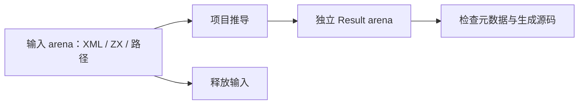
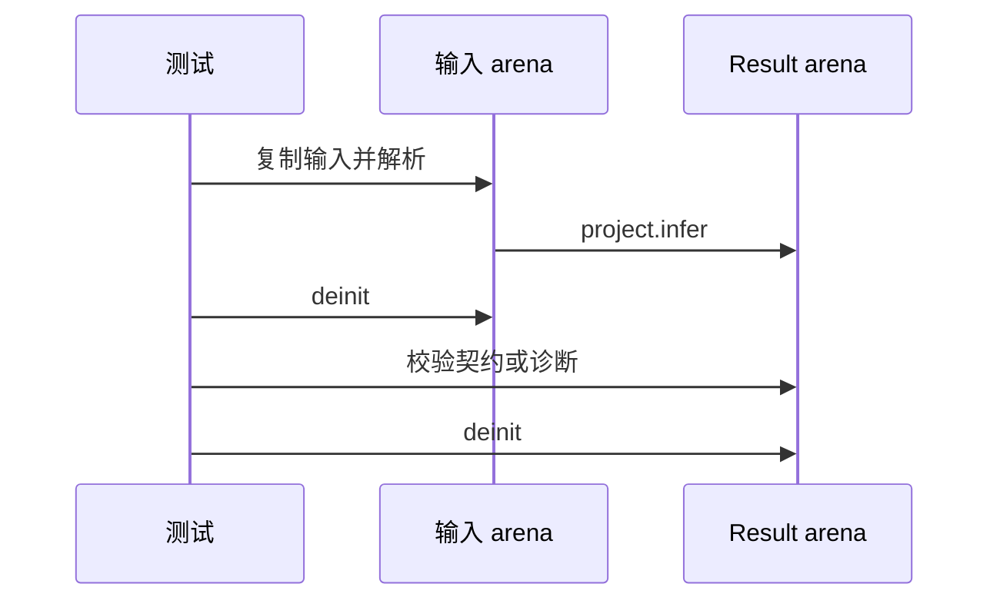

# RX 状态推导生命周期验证

## Intent：最终目标

阶段三百一十三：验证 Store 项目推导结果与输入 XML、源码及路径的内存生命周期分离，成功与失败路径释放完整。

## Data：可用证据

project.infer 创建独立 Result arena；Store 分析复制定义名称、对象名称与规范化路径。既有推导测试在 Result 使用结束后才释放 XML，尚未覆盖输入先释放的项目级 Store 契约。

## Edges：边界与限制

验证成功契约、非法 setter 诊断与重复 Store 注册诊断。输入路径、源码与 XML 全部来自单独输入 arena，返回 infer 结果前释放。此处不证明所有任意项目及第三方外部上下文的生命周期。

## Answer：交付格式与成功标准

新增 store/lifetime_test.zig；先释放输入，再核对元数据与诊断，成功路径继续验证应用和初值 IR 并生成源码。三个路径各执行逐分配失败。实际运行 `cd packages/test && zig build test-rx-inference --summary all`：4/4 构建步骤、138/138 测试通过。本阶段新增六项，包含三个基本生命周期检查和三个逐分配失败检查。

## 自我复核

已核对 infer helper 返回前执行 XML deinit 与输入 arena deinit；结果使用独立 allocator 所属 Result arena。输入源码和路径均复制到输入 arena，避免静态字符串存活掩盖路径或源码借用。释放输入后核对槽位路径、定义路径、Store 名、Object 名、版本，并分别校验与生成应用和初值 Program。

成功、非法 setter 与重复 Store 注册三个路径均通过逐分配失败检查；检查覆盖输入准备、推导、IR 校验和源码生成，不只覆盖成功解析。诊断核对 code、path、行号及非空 message；此处不是新增完整诊断文本契约。未发现实现缺陷，未向实现聊天发消息；本次未修改生产源码。格式化及本次 diff 空白检查通过。未重新执行完整根回归。
