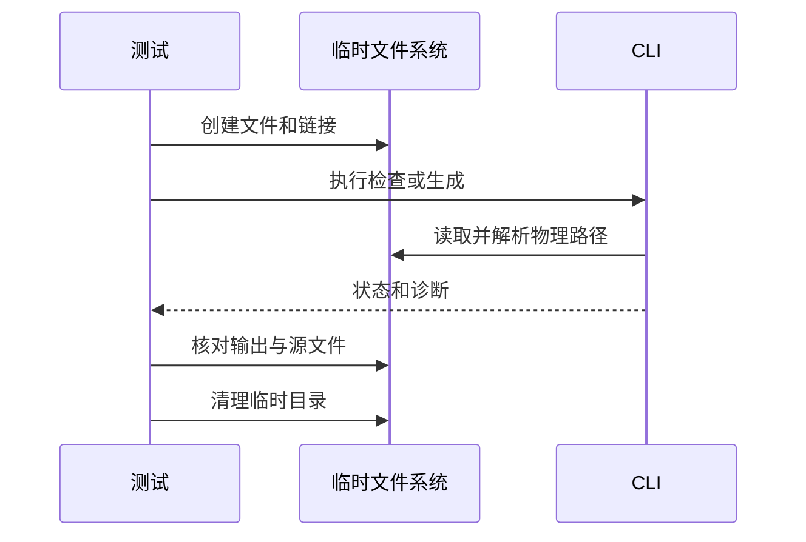

# RX 状态文件物理边界验证

## Intent：最终目标

阶段三百一十四：通过真实 CLI 和临时文件系统验证 Store 依赖身份与项目根限制。

## Data：可用证据

CLI collection.load 对每个依赖执行 realPath，拒绝同物理文件重复注册与项目根外文件。库级不同规范化路径测试未覆盖符号链接。

## Edges：边界与限制

本阶段验证本机符号链接语义，涵盖 check-rx --entry 与源码生成两个入口；不宣称其他操作系统或持久化语义。单一根内链接允许，链接和原路径同时注册拒绝；词法等价路径先去重；不同物理文件内容相同仍允许。

## Answer：交付格式与成功标准

独立 store_paths_test.ts 实际创建文件和链接，核对 CLI 状态、诊断、输出有无和源文件未变。八种文件布局分别执行两个入口，共十六项。

实际运行 `cd packages/test && zig build test-rx-store-paths --summary all`：16/16 Node 测试通过，10/10 构建步骤成功。已接入 test-rx-cli 和根 test 依赖。

## 自我复核

成功检查仅证明文件装载与推导；不替代生成程序的状态执行验证。

八种布局涵盖词法等价引用、同内容不同文件、根内单独符号链接、原路径与链接双注册的两种顺序、文件链接越界、目录链接越界及断链。每种分别调用检查和生成入口，核对退出状态、精确失败诊断及输入文件内容未变。

首次运行 13/16 通过，三个成功生成场景错误地要求 ABI 文件存在。核对 CLI 生成逻辑可知仅非空 ABI 内容才写文件；本夹具返回标量，已修正为成功生成时主源码存在且非空，失败或只检查时不生成输出。首次错误与修正后日志均保留，未把测试断言错误上报为实现缺陷。

未改生产实现，本次 diff 空白与 Zig 格式检查通过。未重新执行完整根回归，也未声称持久化宿主已经完成。
