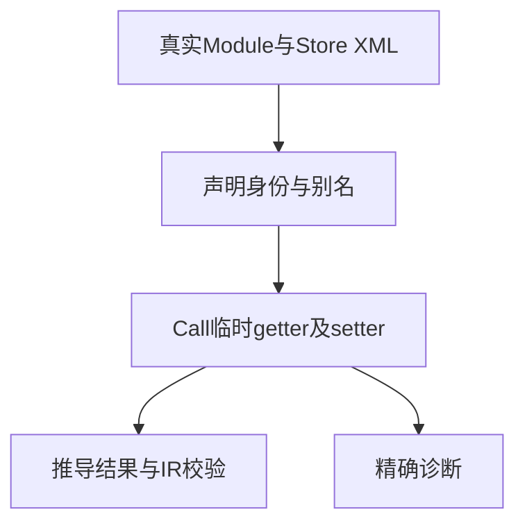
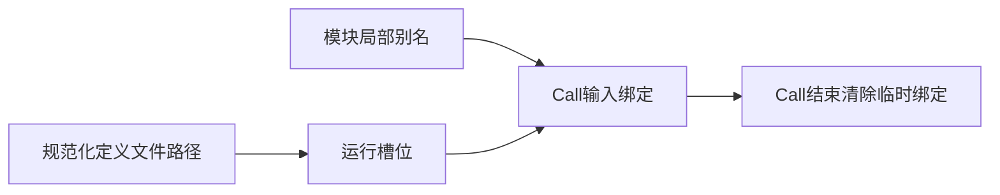

# RX状态权限与作用域验证

## Intent：最终目标

验证新Store调用联结的临时getter作用域、单Object setter授权及命名空间/物理路径身份，避免权限由名字前缀或前一Call泄漏。

## Data：可用证据

当前store/call.zig在setter非单元素列表或未匹配完整对象时报告capability；references.zig按规范化路径登记定义并独立校验别名；Module Schema更早拒绝显式重复as，类别为context。constraints在每次Call结束恢复临时getter，并禁止out覆盖store命名空间。

## Edges：边界与限制

纯库只验证规范化注册路径，不把文本路径当作磁盘realpath证明。两个同名Store文件分别注册以检查槽位不合并；真实软链接另由CLI场景验证。本批成功案例校验IR与槽位，实际提交由阶段307执行测试支撑，不混写证据。

## Answer：交付与成功标准

22项真实XML推导测试：成功路径、getter越界、保留out、六种setter边界、别名规范化及定义身份。每个负例校验code、main.rx、offset、line、column；成功路径校验槽位数量、不同文件槽位路径不同及IR合法。完整推导专项通过。

## 自我复核

相似前缀storehouse必须作为合法对照，防止过宽字符串检查。重复显式别名由Schema拒绝，而不同from的默认显示名冲突由后续注册拒绝，不能预期同一诊断阶段。

## 阶段308实际结果

22项新增全部通过，完整RX推导退出0：4/4步骤、118/118测试。每项负例的类别、文件与offset/line/column均匹配；归一化同文件别名得到一个槽，两个同名显示Store的不同文件得到两个不同路径槽。合法Call getter、单完整Object setter、默认别名与相似storehouse前缀均成功并通过IR校验。

Zig格式与diff空白检查通过，没有实现缺陷消息。两个不同文件的独立性本批验证到推导和IR层，尚未在双槽宿主执行；不能把槽位不同直接当成运行提交隔离已证实。普通ZX import权限、回调捕获、输入释放及源定义分配失败留待下一批。
