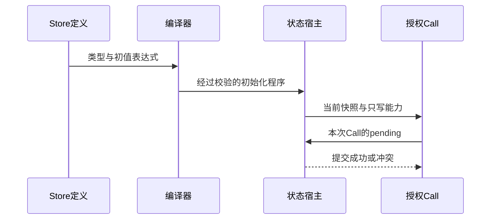
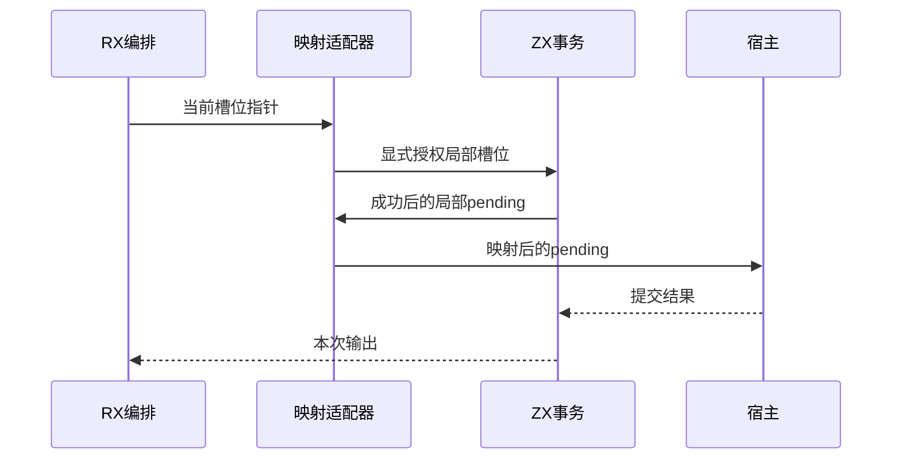

# RX 状态联结实施计划

## Intent：最终目标

让真实 .store.rx 定义进入类型系统、显式调用授权和可运行的状态宿主，保留每个 Call 独立提交的语义。当前开始类型定义与初值阶段；完成初值分析不能记作 Store 调用或持久化已完成。

## Data：可用证据

Store Schema 已保存 name/version、Object 和 Field(name/type/value)，CLI 只做结构检查。ZX Program 有 StoreSlot，Function 没有 Store 能力；RX 将 ZX 入口转成普通 Function 时会丢弃这一实体，Zig helper 也清空 stores。旧 RX 设计给出单个 Call 的快照读取、单 Object setter、暂存、提交与失败丢弃边界。当前正式 ZX 接口通过显式 StoreBinding 和 context.commit 实现入口级提交。

## Edges：边界与限制

每个 Call 的写入独立提交，后续调用失败不回滚已提交调用；不能合并成整个 RX 流程的单次提交。普通 ZX 导入函数不自动继承权限，Call.service 使用被调模块自己的 Store 声明。只读 getter 与 setter 权限分开，不恢复已删除的 Context 功能。

本阶段 Field.type 使用 ZX 类型表达式，Field.value 使用无环境的 ZX 表达式；禁止插入额外声明或函数。不引入动态 any/map、不擅自将空属性解释为默认值。空字符串写为显式字符串字面量。原生 SDK、持久化、并发版本与快照恢复仍要在后续宿主阶段实现。

Store 的身份由规范化定义文件路径与 Object 名组成，显示 Store.name 不作为全局身份。允许同一文件分段声明同名 Object 的不同字段，沿用 Schema 的重复字段拒绝。类型化初始化程序必须通过现有所有权与 IR 校验，输出内存由调用方 arena 持有。

不新增测试、不执行全量测试或浏览器确认。新库 API 和 CLI 定义检查使用真实 XML，验证只使用既有回归和可审阅的应用材料。

## Answer：实施阶段与成功标准

1. 提供 Store 定义分析 API，解析真实字段类型和初值，输出独立的对象初始化 Program；CLI check-rx 的 Store 定义装载接入类型检查。
2. 为带能力的 Call 保留授权与独立 pending/commit 边界，补齐 IR 或生成适配接口；不得把合并 StoreSlot 当作完成。
3. 接入 Module 注册、Call.in 快照和 setter 解析，按共享 TypeId 验证完整 Object 替换。
4. 生成持有状态的宿主，解决请求 arena 与状态存活期、版本检查、失败与恢复；逐项验证后才宣称 RX Store 可执行。

## 阶段一实施

新增 rx_analysis.store.analyze。它先复用 Store Schema，再按规范化文件与 Object 名分析；同名 Object 的所有字段片段按源顺序收集，类型字段排序后仍用字段名映射实际索引。Field.type 只允许一个类型表达式，Field.value 交给既有 XML 属性表达式编译器。共享类型表保持前缀编号稳定，所有初始化 Program 最终使用同一份类型表。

每个 Object 生成无输入的纯初始化 Program，经既有所有权与 IR 校验。API 独立拥有结果，释放输入 XML 后仍能生成代码。CLI collection 在装载 Store 时调用该接口报告语义错误；目前不把初始化程序交付给 RX 调用执行器，后续授权与宿主阶段继续保留。

## 自我复核

没有把初始化 Program 当作动态解释器，也没有把定义分析当作状态提交完成。初值中的运行时运算错误与内存分配错误仍可能在初始化执行时发生。字段字符串必须使用 ZX 双引号字面量；XML 自身的引号与 ZX 字符串引号是不同层次。

静态复核追踪了 XML 释放后的所有权、类型前缀、字段排序和声明注入边界，未发现确定缺陷。父 arena 统一持有中间分析分配；不能提前 deinit 被结果类型表引用的子分析数据。当前尚无新的分配失败专项，不把常规运行成功外推为全部资源失败路径已验证。

## 阶段一验证

- CLI 构建 17/17 步骤通过，既有 RX 文本回归 19/19 步骤、120/120 测试通过。
- 既有 RX CLI 专项 14/14 步骤通过，包含 11 个命令场景、9 个磁盘服务项目场景和 watch 生命周期；未运行全量测试。
- [真实 Store 示例](RX状态联结/示例/state.store.rx)通过 check-rx --entry。独立 [API 使用程序](RX状态联结/演示/generate.zig)先释放 XML 文本和解析结果，再生成两个 Object 的 Zig 初始化程序；演示构建 4/4 步骤通过。
- 两个初始化程序分别编译执行，dispatcher 输出 cursor=0、history=[1,2,3]、label=ready，settings 输出 limits={enabled:true,limit:8}。类型规范顺序与源声明顺序不同，真实输出仍对应正确字段。
- [实际初始化结果](RX状态联结/初始化结果.json)保存输出与材料摘要，[实现快照](RX状态联结/实现/)对应本轮正式源码。未添加测试文件、未调用浏览器。

下一阶段继续每个 Call 的能力携带、setter 解析和状态宿主。当前 CLI 装载只校验后释放定义，没有把它误接到尚无状态生命周期的普通函数执行链。

## 阶段二：显式能力与调用提交边界

Intent：先建立可校验、可生成的函数级 Store 能力，供下一阶段 RX 文本授权接入。

Data：Function、ArtifactNodes 与 genz helper 当前丢失局部 Store 表；调用只保存函数与参数；入口以 stores.len 决定提交。

Edges：普通 ZX import 不获得权限。transaction 函数只调用纯函数；orchestration 函数可以显式转交能力但不能直接写状态。每个 call 的映射必须匹配路径、类型与读写权限，不允许静默扩大权限。现有宿主的 store_N 指针与 commit(pending) 接口继续使用。

Answer：Function 与 Program 显式保存 Store 模式，Call 保存被调函数局部槽位到调用方槽位的映射。生成器在调用处生成轻量局部适配结构，将指针和 pending 映射到上一层；只有 transaction 建立 pending 并提交。单文件与独立函数模块生成均须支持；IR 版本、所有权复制、缓存摘要与验证边界同步更新。当前阶段不宣称 RX setter 文本解析、持久化和宿主生命周期完成。

## 阶段二实施与复核

IR 更新至 9，函数复制与模块恢复保留局部 Store 表和模式；调用映射经过路径、类型、权限、长度与重复槽位校验。编排函数直接写状态、事务函数调用带状态函数、原生函数携带 Store 均拒绝。符号验证显式拒绝状态调用，不把未建模的副作用当作纯函数。

genz 新增结构化 container_type 表达含字段和方法的适配器，生成代码不拼接原始 Zig 文本。单源码 helper 使用各自 pending 类型，独立模块也声明自己的 pending 类型。适配器逐层映射 patch 后仍调用既有 commit(pending)。只写能力无需宿主提供 getter 字段；静态复核发现初稿无条件复制 getter 指针，已按被调方 readable 权限修正。

自我复核发现调用点生成结果还依赖被调方的 readable 权限：仅把函数名纳入指纹会复用过期适配器。FunctionId 指纹现同时包含目标局部 Store 表，使该权限变化失效对应调用点缓存。

## 阶段二验证

项目构建 14/14 步骤通过；既有 CLI Store 专项 9/9 步骤、4/4 测试通过。没有新增测试文件或执行全量测试。

[调用演示](RX状态联结/调用演示/generate.zig)从真实 ZX 文件分析事务函数，再通过显式 IR API 构造两层编排；它用于验证 IR/生成边界，**不是 RX XML 端到端执行证据**。演示构建 4/4 步骤通过。入口额外放置 spare 槽位，将子函数本地 slot 0 映射到入口 slot 1。单源码与独立模块均实际编译执行：

- 正常执行：output=5、count=5、commits=2、spare=99；后续 getter 读取已提交状态，无额外编排提交。
- 第二次提交冲突：error=Conflict、count=4、commits=1、spare=99；先前成功调用保留，失败调用未替换状态。

[实际运行结果](RX状态联结/调用生成/运行结果.json)保存两条生成路径的退出码和原始输出。演示生成器首次构建修正了示例 Span 的显式类型；不涉及正式编译器逻辑。阶段三仍需真实 StoreRef、Call.in 和 setter 文本联结，阶段四仍需持有状态的宿主。
