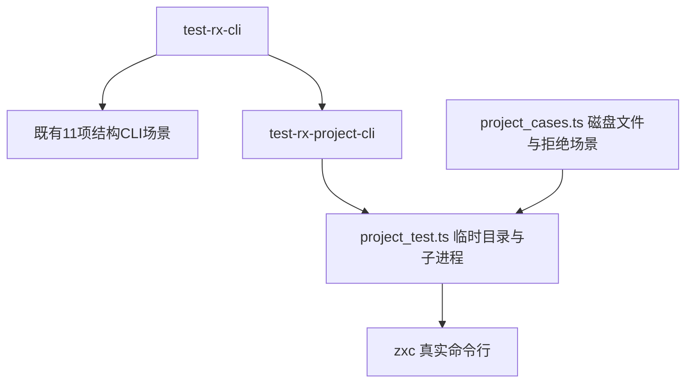
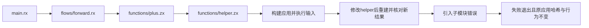

# RX磁盘项目命令行构建验证

## Intent：最终目标

阶段283：验证RX项目CLI磁盘装载、真实应用构建、依赖变化重建及失败发布保护。

## Data：可用证据

最新2b610fe接通RX项目CLI；既有11项check-rx测试主要覆盖结构。新测试沿用子进程、临时目录和输入文件不变断言。

## Edges：边界与限制

结构检查不代替类型推导或执行。超时、信号与其他失败不算预期诊断；仅发现实现问题才通知。

## Answer：交付与成功标准

6项Node测试：一个真实构建/依赖重建/失败保护生命周期，另5项缺失RX、缺失ZX、Import环、子模块错误、越界路径。原始源文件保持不变。

## 测试架构

## 数据流

## 断言与粒度

- 生命周期覆盖路径含空格、嵌套RX服务、ZX相对导入、输入0和7、helper由加3改为加5后重建，以及失败后原应用仍可运行。
- 五项拒绝分别对应RX缺失、ZX导入缺失、未使用Import构成环、子模块名称定位、路径越界。每项检查退出码、诊断、无新生成源码及ABI文件、磁盘输入不变。
- 不把超时、信号或启动错误当成预期失败。生命周期作为一个Node测试计数，不按每次断言增加案例数。

## 自我批判

首次缺失ZX导入夹具没有遵守ZX空行格式，被格式校验提前拦截。已修正夹具格式，并保留初次日志；该失败不构成实现缺陷。测试覆盖命令行构建和语义失败后的产物保护，未覆盖并发构建、进程被杀或磁盘写入失败；不能据此宣称所有发布操作均具备原子性。本轮未执行完整仓库回归。

## 验证结果

`zig build test-rx-cli --summary all`：12/12构建步骤通过；既有11项CLI场景及新增6/6 Node测试全部通过。`npm run typecheck`、`zig fmt --check packages/test/build.zig`和本次相关diff空白检查通过。

缺失ZX导入的实际契约是`module: import target is missing from the source set`，源码`packages/compiler/src/zx/modules/project.zig`及既有watch恢复测试均有相同证据。已将初始笼统文件错误预期收紧为该模块诊断与`functions/plus.zx:1:1`位置，保留核对日志。没有修改实现以满足测试。

RX CLI场景累计17；独立RX运行86、推断76保持不变。JSONL登记64,292、上游审阅1,212/53,597保持不变。本轮没有发现实现缺陷，按用户要求没有向实现会话发送消息。
