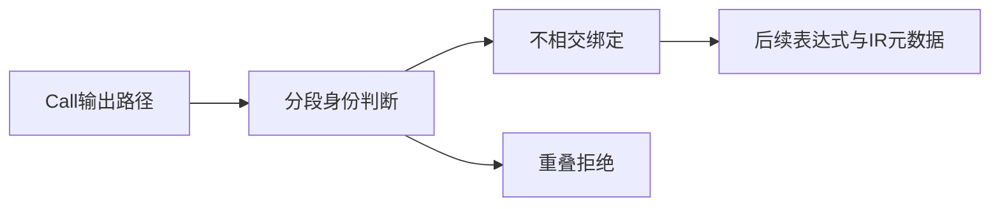
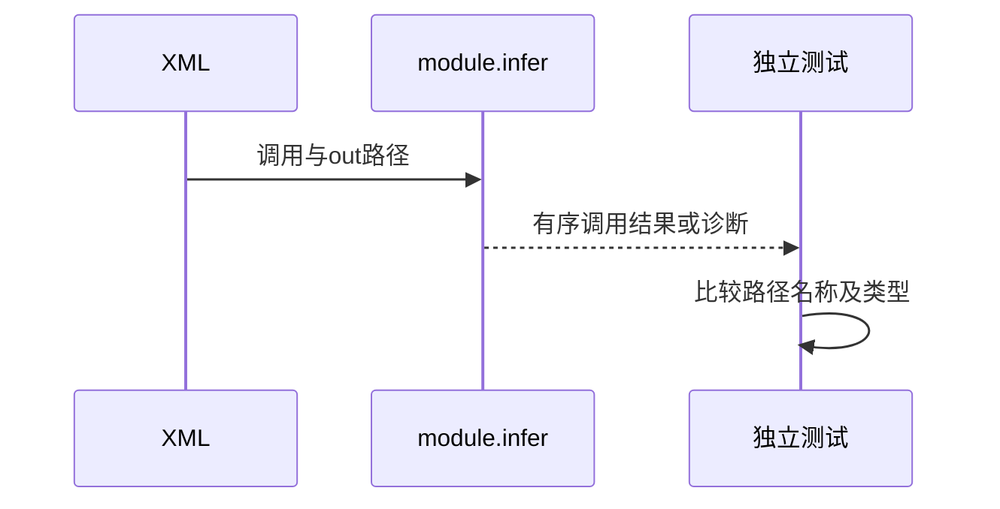

# RX结果绑定路径验证

## Intent：最终目标

阶段250：验证自动契约分析的Call.out路径身份、独立结果与输入命名空间隔离。

## Data：可用证据

module.infer使用binding_path.valid/overlaps拒绝无效路径、$in重叠与重复结果；此前只覆盖顺序绑定正常场景。实现会话正在接入RX执行降为ZX IR，绑定元数据正确性是执行前提。

## Edges：边界与限制

测试词法相近与真正父子路径，保留调用顺序。此阶段仍是分析与IR契约，不声称结果值运行正确。只修改测试，沿用真实XML入口。

## Answer：交付与成功标准

十项覆盖重复、父子双顺序、$in自身及后代、非法空段、相似兄弟字段、$input近似名、丢弃输出及void结果禁止绑定。正例检查有序Call.out，负例检查code/path。

## 实际结果

`test-rx-inference`构建4/4步骤、30/30通过，其中新增10项。重复、父先子后、子先父后、$in自身、$in.child及空路径段均报name；ctx.a/ctx.ab两种不同结果类型可共存，$input不误判为$in后代；省略out时允许丢弃非void输出；void输出绑定报type_mismatch。

正例检查保留的有序Call.out值（包括null）、输入输出类型和IR参数/返回契约。既有20项一起重跑，包括4项分配失败路径。源码和日志、关键实现SHA已归档。格式与本次README diff空白检查通过。

独立RX自动契约API由20增至30；JSONL64,145及Test262上游1,047保持不变。已同步实现会话，未发现新缺陷。

## 自我批判

测试断言的是绑定路径和IR类型，尚未执行两个绑定的运行值，因此不推断执行降级器一定正确。$input只是与$in不相交的普通名称，本例通过不意味着允许覆盖任意保留命名空间。void拒绝案例经过合法ZX void函数加载，避免用无效fixture冒充绑定失败。

当前新增helper字段只为验证有序绑定元数据；没有将生产重叠算法复制为测试oracle。没有生产改动、全仓回归或UI验证。
