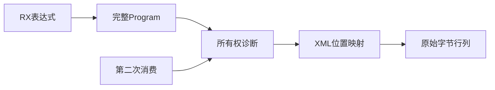
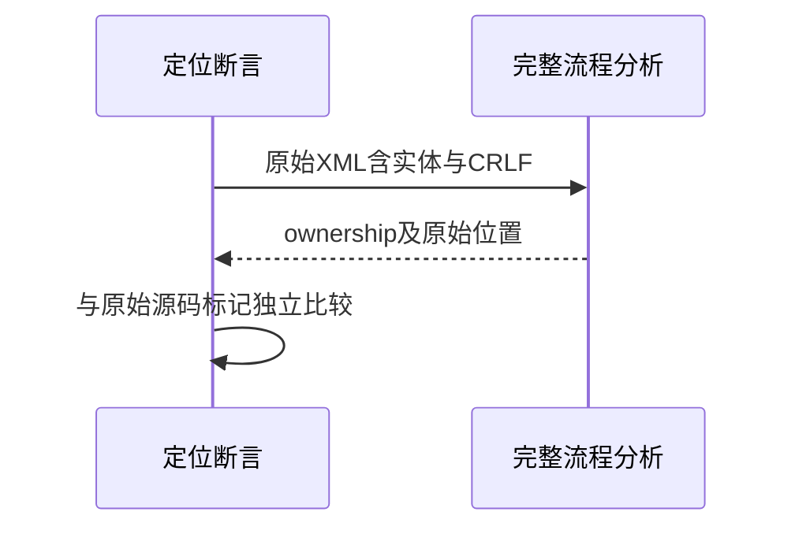

# RX联结所有权诊断定位验证

## Intent：最终目标

阶段263：验证所有权延后至完整RX Program后，错误仍指向原始XML位置，特别是重复消费的第二次访问。

## Data：可用证据

当前module_compile.invalid已调用Module.locate映射源码。阶段249只覆盖提前的名字/解析错误，阶段256所有权边界只断言code，尚缺新后置路径的精确位置证据。

## Edges：边界与限制

四项：借用输入多行Return、美元符号实体、中文CRLF后的借用结果、同一owned结果两次pop的第二次访问。预期原始字节offset/line/column独立计算，不复用生产定位函数。

## Answer：交付与成功标准

四项ownership code/path及精确位置全部正确；既有38契约测试一起通过。没有修改生产，不因旧代码曾固定行列而预判当前仍有缺陷。

## 实际结果

新增4项在现有position_test.zig内，复用独立原始源码扫描；增加last标记让重复消费用例选取最后一次同名表达式。test-rx-inference构建4/4步骤、42/42通过，既有38项同时重跑。

所有权错误均为ownership且来源main.rx。多行Return的$in.pop、&#36;编码的输入名、中文注释与CRLF后的ctx.value.pop，都准确匹配原始offset/line/byte column；重复消费准确落在第二个ctx.items.pop，而非第一次合法消费处。

当前实现已经使用Module.locate，测试没有假设旧固定行列错误仍存在。没有新缺陷或生产修改。格式和本次README diff检查通过；源码、fixture、运行日志与实现SHA归档，结果已同步实现会话。

独立RX契约测试增至42，运行测试仍31；JSONL64,223及上游1,093不变。没有重复增加旧8项定位测试的数量。

## 自我批判

这些是四个后置ownership诊断代表场景，不证明所有跨模块、原生函数或嵌套消费位置均正确。第一次消费已由前阶段正例证明可接受，第二次span通过因此能排除“提前拒绝导致负例假通过”。本轮没有全仓回归或重跑31项运行组，因为只修改定位测试。
