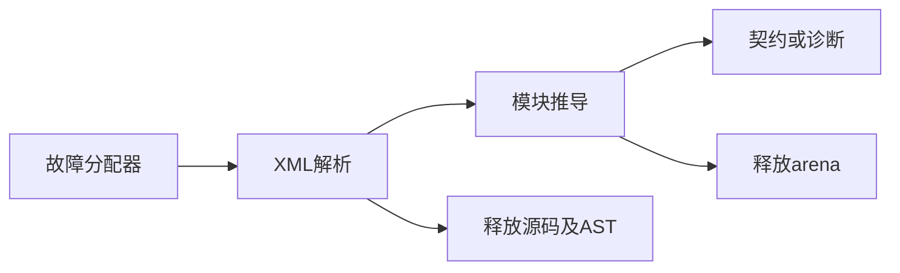
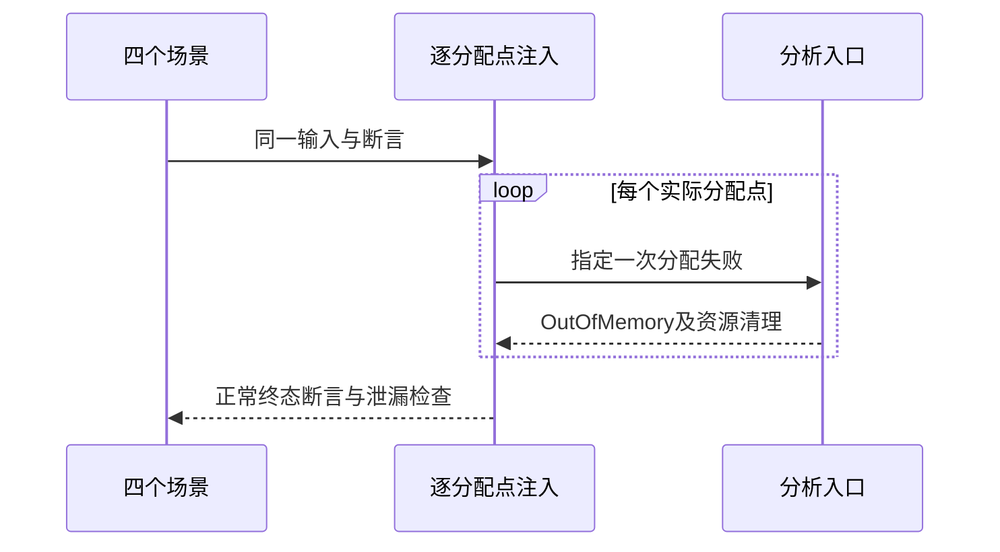

# RX自动契约分配失败验证

## Intent：最终目标

阶段248：验证真实XML到自动契约推导在每个分配点失败时的错误传播与资源释放，补足上一阶段正常分配路径。

## Data：可用证据

阶段247八项正常路径已通过；现有测试helper统一释放XML和推导arena。Zig testing.checkAllAllocationFailures可逐次注入分配失败并检测泄漏或错误吞噬。

## Edges：边界与限制

四个代表场景：标量调用、嵌套字段、顺序结果绑定、冲突诊断。测试范围包含parseXml和module.infer，不包含磁盘装载、流程运行或所有可能输入。只编辑测试。

## Answer：交付与成功标准

保留八项基础测试，新增四项逐分配点验证；同一断言helper在正常与故障分配器下运行，四场景均通过才宣称已覆盖这些路径。失败则保留证据并通知实现会话。

## 实际结果

`test-rx-inference`：4/4步骤、12/12测试通过，其中8项既有基础测试、4项新增checkAllAllocationFailures。四项分别覆盖标量函数、嵌套输入对象、顺序调用结果绑定及类型冲突诊断。每轮使用相同结果断言，不跳过错误终态校验；解析结果与推导结果均按生命周期释放。

helper增加runAllocated接收故障分配器，原run保留既有调用方式；新增root仅聚合基础与资源测试。测试已由原总test入口纳入。格式和本次diff空白检查通过；未修改生产实现。实现版本SHA与测试源码、运行日志均归档。

独立RX自动契约Zig API测试由8项增至12项；JSONL目录仍64,145，上游仍1,047/53,597。逐分配点执行轮次不另计测试用例。

## 自我批判

故障点是到达传入分配器的实际分配请求；arena内不触发底层分配的子分配无法逐个独立注入。本轮未报告泄漏或吞错，但不能推出所有表达式、对象展开和所有原生接口均满足相同性质。

正例仍验证分析结果与IR类型，不是流程运行。没有调用浏览器、全仓回归或额外TypeScript检查；本轮没有修改TypeScript或JSONL生成逻辑。
