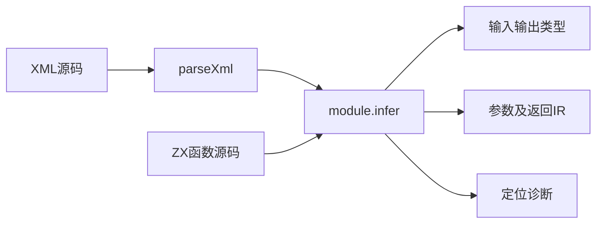
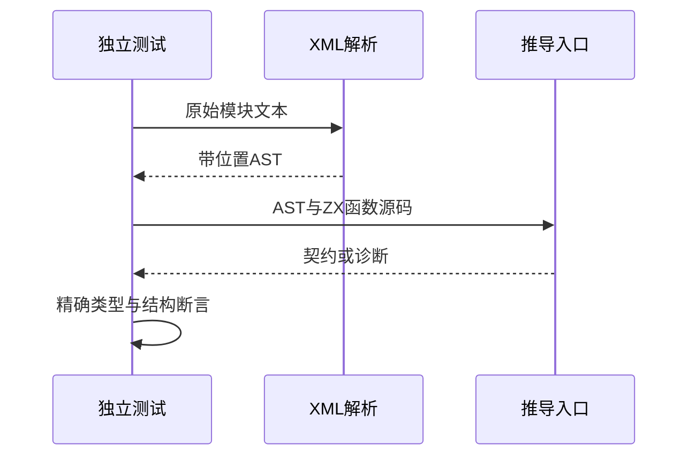

# RX自动契约基础验证

## Intent：最终目标

阶段247：为新公开module.infer建立独立真实XML到类型契约的基础测试，不把Schema校验或类型推导误称流程运行。

## Data：可用证据

正式rx_analysis导出module.infer，接收rx AST与ZX源码集合，生成input/output类型、调用参数IR、返回IR。实现会话正在修改对象展开和数值约束传播。本轮沿用expressions/xml成熟测试布局与真实parseXml入口。

## Edges：边界与限制

只测试顺序Call.fn和Return基础契约；不碰实现文件，不预设对象展开新规则，不依赖手工AST。八项不计入JSONL目录和Test262上游数。

## Answer：交付与成功标准

八项覆盖空模块、固定布尔Return、输入约束、嵌套字段、顺序绑定、缺少类型约束、类型冲突和不可达语句；检查精确类型结构/调用数量/返回IR或诊断代码。公开入口实际测试通过，并记录失败和修复通知。

## 实际结果

`zig build --build-file packages/test/build.zig test-rx-inference --summary all`：4/4步骤、8/8通过。测试真实解析XML，检查精确输入/输出标量类型；嵌套输入逐层检查仅有user/id字段并最终为u64；检查Call数量、参数IR输出类型与被调函数输入相等、Return IR输出与契约输出相等。三个负例验证main.rx来源和准确诊断代码。

空模块为void→void，固定Return为void→bool；单函数调用为u64→u64，嵌套字段调用为{user:{id:u64}}→u64；text→length顺序绑定为string→u64。无法约束的$in与u64/string冲突报type_mismatch；Return后语句报return_path。

测试已注册独立test-rx-inference并接入总test入口。格式与本次构建注册diff空白检查通过。八项是独立Zig API测试，不计入JSONL的64,145目录数，也不增加Test262上游1,047审阅数。已通知实现会话新增覆盖及验证结果。

## 自我批判

第一次构建由于测试脚手架引用不存在的compiler.module("zx")失败，已修正为公开compiler模块的ir导出后重新构建通过；不是生产实现缺陷。实现仍在变化，记录了当前相关源码SHA用于定位验证版本。

测试分配器覆盖本轮正常成功/失败的释放，不等于逐分配点OOM验证。负例本轮检查代码与来源，尚未检查精确XML错误位置；对象展开、数值传播、原生联结和完整流程执行不在本轮范围。没有运行完整根回归或UI检查。
