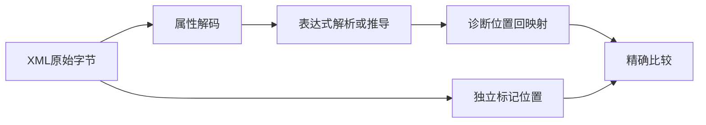
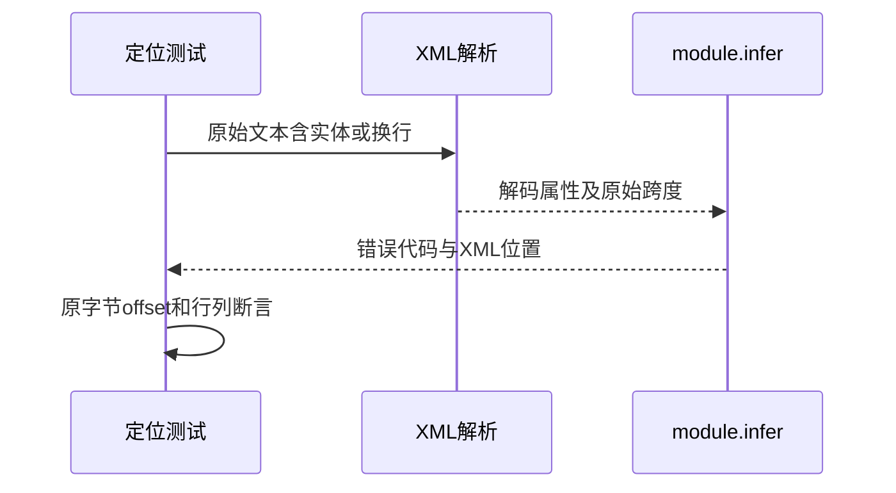

# RX自动契约诊断定位验证

## Intent：最终目标

阶段249：检查新module.infer真实XML入口的表达式错误精确映射，覆盖推导错误report与解析错误parseFailure两条路径。

## Data：可用证据

当前实现先解码属性，再解析/推导表达式，sourceSpan映射为原始XML字节位置；已有独立表达式XML测试不能证明module.infer集成没有再次偏移。

## Edges：边界与限制

新增八项只检查错误代码、文件、字节偏移、一基行与字节列。选择未知名字与缺少右操作数，避免依赖正在调整的数值及展开语义。真实XML，未手造AST。

## Answer：交付与成功标准

Return与Call.in覆盖普通名字、首字符实体、中文前缀、CRLF与属性尾解析错误。预期由原始源码标记及原始换行计算，不调用生产位置映射helper。

## 实际结果

`test-rx-inference`：4/4步骤、20/20通过。其中新增8项位置测试：Return普通名字、首字符十进制实体、中文注释前缀、属性内CRLF；Call.in首字符实体、调用前CRLF；Return解析到属性尾、Call.in的加号实体后解析到属性尾。

每项断言code、main.rx、原始byte offset、一基line和byte column，预期扫描原始字符串而不调用rx.attributeLocation或ZX定位函数。两项解析尾错误定位在闭引号字节处；实体名字定位实体起始字节。既有8基础+4分配失败一起重跑通过。

格式检查通过，源码及日志副本与两个关键位置实现SHA归档。独立RX API测试由12增至20；JSONL64,145及上游1,047/53,597不变。已向实现会话同步结果，无新缺陷。

## 自我批判

本轮验证unknown-name和parse-EOF两类代表诊断，不涵盖所有类型冲突/函数装载/对象展开错误的位置。line/column基于字节的规则来自公开XML约定，不能误用Unicode字符列解释。没有全仓回归、生产修改或流程运行验证。
