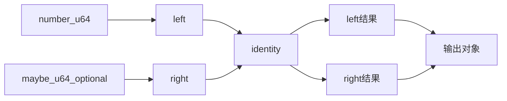
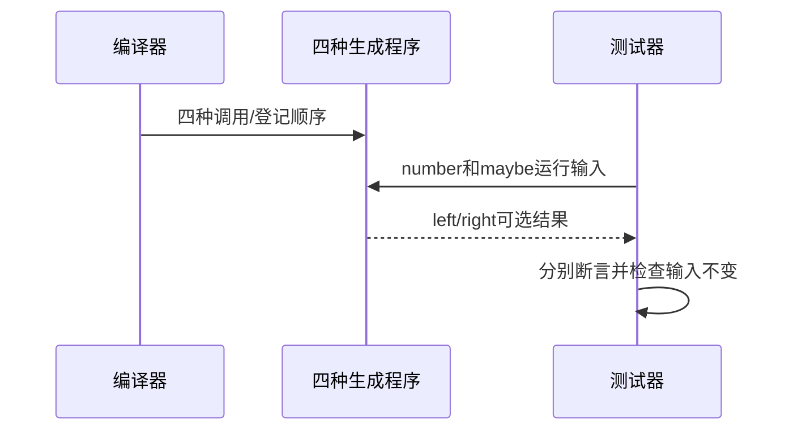

# RX菱形共享服务真实执行验证

## Intent：最终目标

阶段278：执行共享identity服务的菱形项目，核对非空值包装、null/零传递和两次调用结果隔离。

## Data：可用证据

上一阶段同一组XML在四顺序组合下类型推导通过；本轮四组合各自emitBundle生成程序与ABI，运行不同number/maybe输入。

## Edges：边界与限制

共享服务的统一输入输出是u64?，不能假定每次调用生成专门签名。四编译场景各5输入是20次执行，不是20种独立语法特性。不外推可选聚合所有权。

## Answer：交付与成功标准

四组合×5输入包括null、零、不同值及最大值；left精确保留number、right精确保留maybe，输入不变。完整RX运行套件通过，发现问题才通知实现会话。

## 实际结果

新增20项运行全部通过，完整test-rx-runtime构建55/55步骤75/75通过。四种产物独立运行5组输入，每例分别检查left等于包装后的number、right等于maybe，并检查入口对象未改变。最大值与相邻值均精确保留。

compile_project.zig扩展四种受控diamond模式，XML仍真实解析，登记数组按照模式排列；共享既有项目推导/IR校验/emitBundle/ABI写出逻辑，没有业务返回值特例。新的fixtures嵌入编译依赖，旧三级链两种产物也随完整运行套件复验通过。工具78行，不引入额外抽象层。

格式及本次diff检查通过，源码草稿、日志及实现哈希保存。独立RX运行75、推断62；JSONL与上游审阅保持不变。无新实现问题，按用户要求不发送通过消息。

## 自我批判

五组值覆盖缺失/零/不同值/边界，不是所有u64的穷举。四生成场景确实独立，但不能将20次执行解释为20种特性。当前返回标量字段，没有证明共享服务返回可变聚合的所有权隔离、错误跨服务传播或宿主能力。没有生产修改、全仓回归或UI验证。
