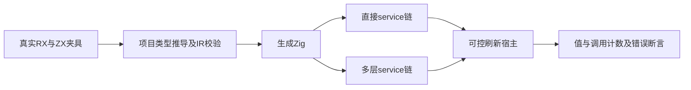
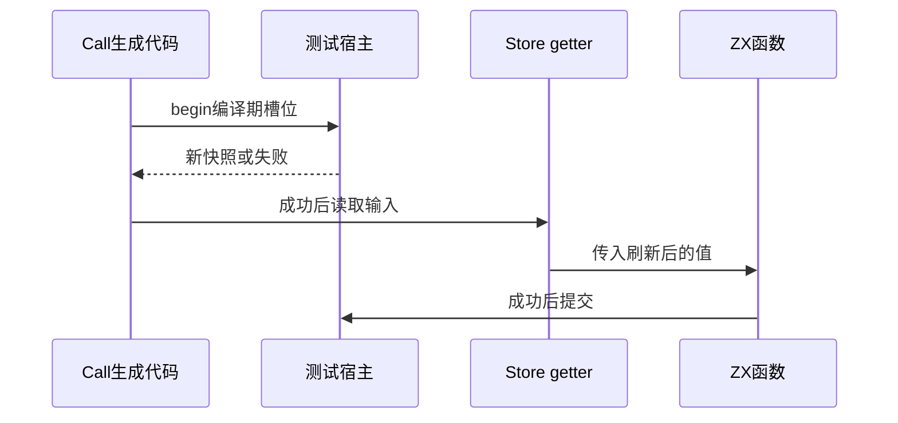

# RX 调用刷新边界验证

## Intent：最终目标

阶段三百三十：为已落地的Store Call边界生成补充独立实际执行测试，验证刷新在getter之前、失败传播和嵌套service转发。

## Data：可用证据

实现聊天已提交9558244，begin.zig生成调用前刷新，begin_adapter.zig映射嵌套槽位。当前真实XML夹具有store_calls与store_services两条调用链，各包含两次写Call和一次读Call；原有宿主无begin，继续检验兼容性。

## Edges：边界与限制

新增宿主为测试用可控外部快照源，不是专用生产runtime。每次begin读取指定快照，并核对编译期槽位恰为0；fail_at在刷新修改前失败。这里只验证当前生成接口，不宣称CLI持久状态或磁盘事务已完成。保留既有源码生成路径，经过真实XML、project.infer、IR校验、Zig生成和执行。

## Answer：交付格式与成功标准

新增刷新宿主和独立测试文件，由两条已有真实调用链复用。分别验证变化快照、u64边界、第一/第二/第三次刷新失败与分配失败清理。运行RX专项，并保留结果及自我复核。

## 自我复核

必须让每次外部快照与旧提交值不同，否则遗漏刷新也可能通过。失败路径同时断言begin次数、提交次数和保留状态；原有无begin宿主继续验证兼容性。新增测试不修改实现，不将演示成功替代生产生命周期验证。

## 验证结果

在packages/test运行`zig build test-rx-runtime --summary all`，90/90步骤、167/167项通过。本轮7个独立测试通过两条真实调用链执行，共新增14项；包括成功与后续失败两种分配失败逐点注入验证。JSONL数量65194不变，独立RX运行测试由153增至167。

两条调用链均恰好刷新3次；每次槽位数组为[0]，观察到变化后的外部快照，第一/第二/读Call刷新失败分别保留0/1/2次已完成提交。u64最大值与旧快照值、历史数组保持通过。原有无begin宿主回归仍通过。

首次命令误在根目录运行无此名称的专项，已改到packages/test。首次宿主直接字段赋值不符合输出的不可变指针ABI，改为在同一arena中分配新对象后替换槽位，并额外核验旧对象值不变；这是测试夹具错误，日志保留。没有生产实现缺陷，无需通知实现聊天。格式检查通过，未重跑全根回归。

当前验证仅一物理Object的直接与嵌套映射；多Object非恒等映射和同Call重复getter去重仍需另补，不能由本批[0]断言推断任意槽位映射正确。正式持久状态生成与CLI接入由实现聊天继续开发。
