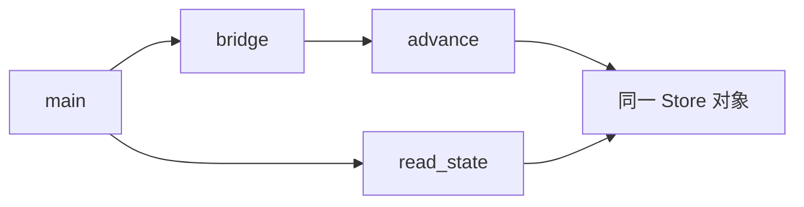
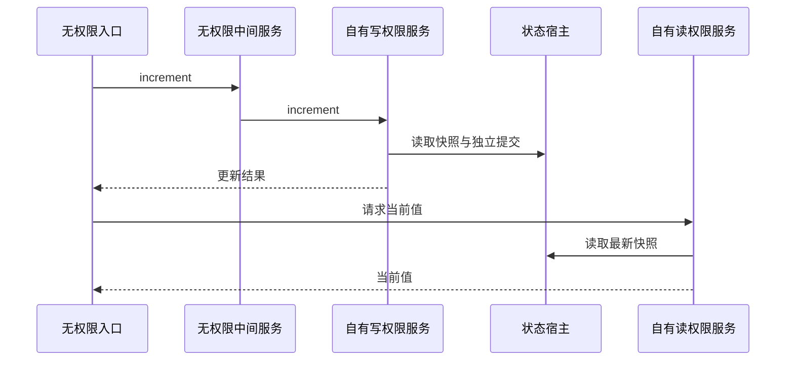

# RX 跨服务状态执行验证

## Intent：最终目标

阶段三百一十一：验证未声明 Store 的入口与中间服务可以调用自行声明权限的服务，实际写入与读取仍共享一个状态槽。

## Data：可用证据

沿用阶段三百零七的真实 XML、ZX、Store 初始化程序和九项宿主执行断言。新项目入口连续调用 bridge，bridge 转发 advance；独立 read_state 服务声明 reader 别名后读取当前值。

## Edges：边界与限制

复用九项断言在新的四模块调用图上执行，不声称新增九种状态算法。显式测试宿主不代表原生持久化宿主完成。未声明服务仅转发输入输出；写权限属于 advance，读取权限属于 read_state。

## Answer：交付与成功标准

正式夹具位于 packages/test/tests/rx/runtime/store；新增 store_services 构建模式。项目必须推导为一个 Store 槽并通过 IR 校验，九项执行包含冲突、分配失败与跨请求状态保持。实际执行 `cd packages/test && zig build test-rx-runtime --summary all`：86/86 构建步骤、144/144 测试通过（既有 135 项加新项目形态 9 项）。完整日志保存在 RX跨服务状态测试草稿/运行回归.log。

## 自我复核

已确认新增入口与 bridge 均无 Store 声明；advance 和 read_state 各自声明 inner、reader，推导检查固定为一个物理状态槽。九项既有断言在新调用图独立运行，包含完整初始化、实际生成执行、逐分配失败与冲突后保留前次提交。

新增的是调用图覆盖，不是九套全新的断言。未覆盖两个物理 Store 的实际双槽隔离，亦未证明原生宿主持久化；后续继续补齐。未发现实现缺陷，未向实现聊天发送消息。本次 diff 空白检查通过；未重新执行完整根回归。
