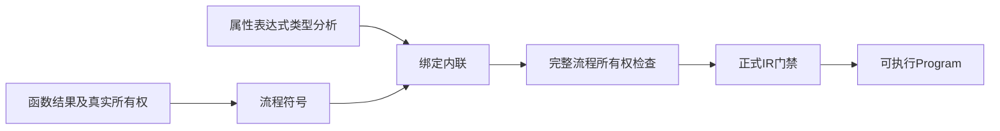
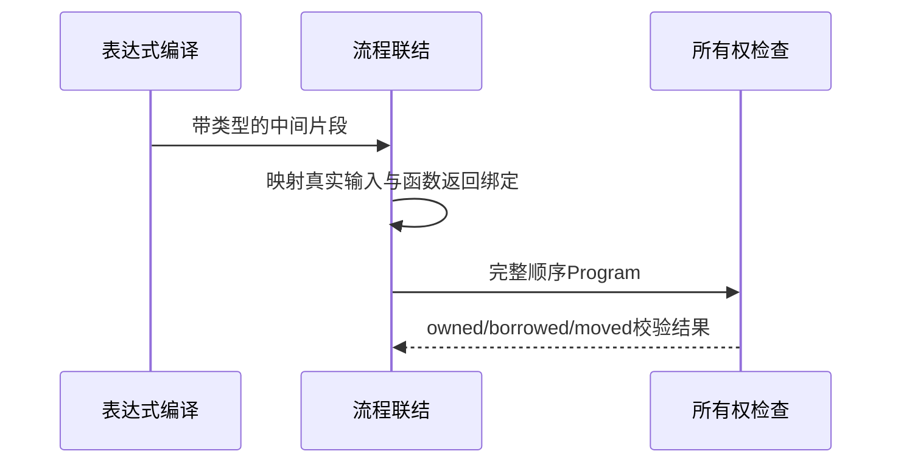

# RX 跨步骤所有权修复计划

## Intent：最终目标

使函数新建的 owned 结果在后续 RX 表达式中保留真实所有权，允许一次合法消费，同时继续拒绝借用输入消费、借用函数结果消费和重复消费。

## Data：可用证据

独立测试会话提供同等 ZX/RX 的 make→pop 复现：ZX 通过，RX 在独立属性表达式编译时提前拒绝。expression_program 当前将所有绑定装入借用的合成环境 tuple，再立刻做所有权检查，已经丢失之前函数调用产生 owned 值的事实。完整 RX Program 的降级与统一所有权门禁已实现，能看到真实生产者和全部后续用途。

## Edges：边界与限制

不全局关闭所有权，不把所有绑定标成 owned，不硬编码 pop 或某个函数。独立表达式入口继续完整检查；仅用于完整流程联结的中间表达式采用明确的 compileForLinking 阶段，延后到绑定映射完成后的统一所有权检查。中间 argument/result 片段不作为可独立执行的函数承诺；Contract.program 必须继续通过正式 IR 检查。

不新增测试，不运行全量测试。复用另一会话已经写好的真实复现及其负对照确认修复。

## Answer：交付与成功标准

新增明确的联结阶段入口，正式 module_compile 使用它，并保留完整程序的所有权与 IR 双重门禁。已有 owned 复现通过，borrowed 负对照仍拒绝；公开文档说明中间片段与执行 Program 的区别。单独提交修复并推送，CLI 未完工作不混入。

## 自我复核

此前单个参数 Program 的独立检查把借用的合成调用约定误当成完整流程语义。修复的是校验阶段与证据不足的问题，不通过放宽语言所有权来让复现通过。实际结果待记录。

## 实际结果

已复用测试会话的四项既有对照，`zig build --build-file docs/2026-10-04/RX新建结果消费复现/build.zig test --summary all` 为 4/4 步骤、4/4 通过：ZX 函数返回新建列表消费、等价 RX 跨 Call.out 消费、RX 表达式内新建列表消费均通过，借用函数结果的消费仍返回 ownership 诊断。未新增测试、未执行全量测试。

完整流程最终的 analyzeOwnership 与 validateIr 保留，独立表达式入口的检查保留。尚需独立会话补充跨步骤重复消费与实际 pop 输出；不将四项有限对照扩大为所有所有权情形均已验证。
