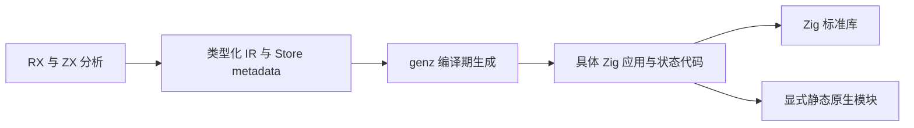
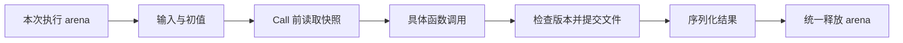

# RX 零运行时宿主修正计划

## Intent：最终目标

严格遵守 zero runtime：生成应用不依赖 zxc 专用运行库、VM、解释器或动态加载机制。Store 所需的状态字段、文件操作与提交检查由 genz 在编译期生成普通 Zig 代码，依赖 Zig 标准库及显式静态原生模块。

## Data：可用证据

此前新增 packages/runtime 是实现偏离，不能以“可静态链接”为理由将其视为满足 zero runtime。该包尚未接入正式 CLI 构建与发行工具链，目前只有文档中的演示程序依赖它。

当前 CLI runner 为单次执行：解析输入、调用 application.execute、序列化输出，然后结束。输入和生成函数共享调用方 arena。旧状态及输出借用可以保留在本次执行 arena 中；没有必要为此引入独立 Store/Request 框架、版本节点引用计数或未来长期运行宿主的抽象。

已经完成的独立初值模块、共享 ABI、物理身份与生成缓存属于编译期能力，可以保留。磁盘原子替换、版本冲突检查与数字精度问题的已有证据可以指导生成代码，但专用运行库路线撤回。

## Edges：边界与限制

zero runtime 不消除应用执行时必需的文件 I/O、内存分配或版本检查；这些应成为生成应用自身的具体 Zig 实现。不能将现有 runtime 原样复制到生成目录后，将专用运行库改称为生成代码。

不提前引入尚未接入的长期进程、通用调度、动态注册或跨请求内存缓存。逐 Call 刷新、旧值存活期与提交点仍须正确；应以实际入口的 arena 生命周期及编译期已知的 Object 布局实现。

原生 Store 构建保护在完整生成链路通过实际执行之前保留。撤销代码只处理本会话新增的 runtime 及依赖它的演示，不影响其他会话工作，也不撤销有效的编译期初值与缓存能力。

## Answer：修正顺序与成功标准

1. 撤销正式 packages/runtime 包及对应的活动演示依赖；旧提交保留历史证据，原实施计划标记为已撤回。
2. genz 按应用实际 Store 槽位生成具体状态字段、初值执行、读取、条件提交和清理代码。旧值由本次执行 arena 保持存活，不新增通用引用计数框架。
3. compiler 只负责模块图、共享 ABI、初值及 metadata；CLI 只负责构建和入口。生成产物不得导入 zxc/runtime 或携带专用运行库。
4. 使用实际生成产物验证跨 Call 旧值、跨进程恢复和冲突、错误时提交边界；检查源码依赖图及发行内容，确认只含生成 Zig、Zig 标准库和显式静态模块。

## 自我复核

此前把职责分包误用为新增运行库的理由，遗漏了优先级更高的架构约束，并为尚未需要的生命周期场景加入了额外机制。后续按生成产物的实际依赖和执行模型验收，不以包名、静态链接或单独示例通过作为 zero runtime 的证据。

## 本次修正结果

已删除 packages/runtime、依赖该包的演示程序、对应活动运行记录及本地演示可执行文件。保留有效的编译期初值生成、缓存、共享 ABI 和普通 RX/ZX 项目。正式 packages、根构建及清单中检索不到 packages/runtime 或 zxc_runtime 引用；根构建 14/14 步骤通过，未运行全量测试。zero runtime 约束已补入根 AGENTS.md，后续跨阶段实施必须持续遵守。

## Call 边界生成

RX 将一次 Call.in 的 Store getter 降为紧邻调用之前的快照语句。genz 必须在这组语句开始之前生成一次 begin 调用；所需槽位由 getter 和目标事务函数的 Store 授权在编译期确定。纯 service 的内部调用自行建立边界，不因传递权限而提前刷新整个子流程。

槽位数组作为 comptime 参数传递；嵌套适配器在编译期映射到父槽位，不产生动态注册表或动态分派。既有显式宿主仅有 store_N 和 commit，使用 Zig 标准库的编译期方法检查兼容它们；新生成的具体宿主必须实现 begin。分支里的 Call 只在分支真正执行时刷新，事务函数内部不重复刷新已用于构造输入的快照。

### 实施与验证

正式 genz 已加入 Call 边界生成、编译期槽位数组与适配器映射。node/printer 增加 comptime 表达式、comptime 参数和引用捕获，以现有 AST 生成普通 Zig 语法。

根构建 14/14 步骤通过；既有调用演示与初值演示分别 4/4 构建通过。既有 Store 定向回归 4/4 通过，没有执行全量测试。代码按仓库 scripts/format.mjs 格式化。

Call 边界阶段使用显式状态草稿和既有请求项目验证实际生成代码。两次独立进程调用分别刷新版本 0、0、1、2 和 2、2、3、4；结果分别为 original=3、first=4、second=5，以及 original=5、first=12、second=19。旧输入保留原值，下一进程恢复上次提交值。该阶段的草稿后来由下述编译器自动生成实现替代，旧单槽状态文件已移除。

### 自我复核与剩余边界

Call 分组依赖当前 RX lowering 的明确排列：若干直接 store_get 常量紧接直接 call 常量。若以后引入语句重排或新的调用表达式形状，必须维护这一约定或改为显式 IR 边界；不能扩展为依据业务内容猜测调用组。

该阶段剩余的具体多 Object 状态生成、刷新与提交检查、compiler bundle 与 CLI 接入已在下一节落实。显式草稿的一槽位限制没有进入正式生成器。

## 具体 State 生成

genz 接收按应用槽位顺序排列的物理身份、Schema 版本、类型身份、初值模块和写权限，生成每个 Object 的具体字段与文件操作。begin 在编译期选择所需槽位，按物理身份排序获取全部锁，全部读取成功后发布值。commit 在任何写入前拒绝多个非空 Object 和无写权限的 Object，随后校验磁盘版本、原子替换文件并更新内存；替换后的目录同步失败报告已提交但持久性尚未确认。

compiler 以独立 state.append 入口将 zxc_state 加入 bundle；State 依赖 application 和实际使用的初值模块，application 不反向依赖 State。缓存键覆盖有序槽位元数据，初值表达式变化由独立初值模块缓存负责。入口负责持有 arena 和目录句柄，以及在 State 地址固定后调用 initialize；执行期间不得移动 State。

草稿存放于 RX状态宿主/生成器草稿。具体 State 生成与 CLI 接入现已完成：原生构建只加入实际使用的 Object 初值模块，runner 显式接收 --state-dir 与输入。State 模块标记、实际 runner 源码和完整模块图进入构建摘要。

正式 zxc build 已构建既有请求项目，应用在两个独立进程中分别得到 3→5 与 5→19，旧输入分别保留 3 与 5。临时状态目录只有实际引用 Object 的一个 JSON 快照及一个稳定锁文件；未使用的另外两个 Object 没有创建状态。结果保存于零运行时生成/原生构建结果.json。

原样复用 RX双状态槽测试草稿/dual/fixtures 的既有七个输入文件，正式构建并连续运行两次：左侧 3→4→6，右侧 100→101→103；history 分别为 [8]→[9]→[10] 与 [50]→[51]→[52]。两个同名 Object 按文件身份隔离，旧输出保留原数组，未修改的右侧在左侧提交后仍保持原值。结果保存于零运行时生成/双对象原生结果.json；没有新增测试案例。

既有初值缓存演示确认：首次生成 9 个单元；重复运行生成 0；只修改一个初值时仅生成 1；恢复后生成 0。State 源码未因初值正文变化而重建。根构建 14/14 通过，未执行全量测试或新增测试用例。

### 验证限制

本轮实际运行环境为 macOS。多 Object 完整应用已实际运行，锁顺序和失败发布另做源码复核；Windows/Linux 的文件锁和目录同步以及断电恢复尚未验证。initialize 按 Object 建立初值，不提供跨 Object 的初始化回滚；后一个对象初始化失败时，前面建立的文件可以保留。CLI 要求调用方提供已存在的目录，不承诺替调用方完成父目录创建的耐久性。

正式 CLI 重复构建报告 generated=0、reused=10、loaded=7、written=0。单 Object 与双 Object 应用均通过生成 State 模块运行，产物只连接应用、具体函数、具体初值、State 和共享 ABI；没有 zxc 专用运行库依赖。

### 序列化自我复核

Zig 标准 JSON 序列化器对浮点无穷值可能生成不符合 JSON 语法的文本。生成 write 方法在原子文件操作前调用标准 JSON 验证；非法编码返回 InvalidStoreEncoding，避免写入下一进程无法恢复的快照。当前不把浮点无穷值的持久化声明为已支持。普通数值直接按具体 Snapshot 类型恢复，仍避免动态 JSON 中间浮点转换造成的大整数精度损失。
