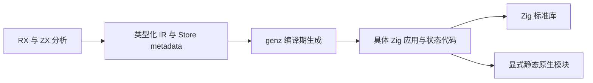
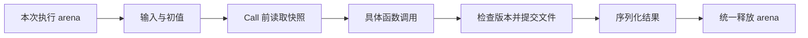

# RX 零运行时宿主修正计划

## Intent：最终目标

严格遵守 zero runtime：生成应用不依赖 zxc 专用运行库、VM、解释器或动态加载机制。Store 所需的状态字段、文件操作与提交检查由 genz 在编译期生成普通 Zig 代码，依赖 Zig 标准库及显式静态原生模块。

## Data：可用证据

此前新增 packages/runtime 是实现偏离，不能以“可静态链接”为理由将其视为满足 zero runtime。该包尚未接入正式 CLI 构建与发行工具链，目前只有文档中的演示程序依赖它。

当前 CLI runner 为单次执行：解析输入、调用 application.execute、序列化输出，然后结束。输入和生成函数共享调用方 arena。旧状态及输出借用可以保留在本次执行 arena 中；没有必要为此引入独立 Store/Request 框架、版本节点引用计数或未来长期运行宿主的抽象。

已经完成的独立初值模块、共享 ABI、物理身份与生成缓存属于编译期能力，可以保留。磁盘原子替换、版本冲突检查与数字精度问题的已有证据可以指导生成代码，但专用运行库路线撤回。

## Edges：边界与限制

zero runtime 不消除应用执行时必需的文件 I/O、内存分配或版本检查；这些应成为生成应用自身的具体 Zig 实现。不能将现有 runtime 原样复制到生成目录后，将专用运行库改称为生成代码。

不提前引入尚未接入的长期进程、通用调度、动态注册或跨请求内存缓存。逐 Call 刷新、旧值存活期与提交点仍须正确；应以实际入口的 arena 生命周期及编译期已知的 Object 布局实现。

原生 Store 构建保护在完整生成链路通过实际执行之前保留。撤销代码只处理本会话新增的 runtime 及依赖它的演示，不影响其他会话工作，也不撤销有效的编译期初值与缓存能力。

## Answer：修正顺序与成功标准

1. 撤销正式 packages/runtime 包及对应的活动演示依赖；旧提交保留历史证据，原实施计划标记为已撤回。
2. genz 按应用实际 Store 槽位生成具体状态字段、初值执行、读取、条件提交和清理代码。旧值由本次执行 arena 保持存活，不新增通用引用计数框架。
3. compiler 只负责模块图、共享 ABI、初值及 metadata；CLI 只负责构建和入口。生成产物不得导入 zxc/runtime 或携带专用运行库。
4. 使用实际生成产物验证跨 Call 旧值、跨进程恢复和冲突、错误时提交边界；检查源码依赖图及发行内容，确认只含生成 Zig、Zig 标准库和显式静态模块。

## 自我复核

此前把职责分包误用为新增运行库的理由，遗漏了优先级更高的架构约束，并为尚未需要的生命周期场景加入了额外机制。后续按生成产物的实际依赖和执行模型验收，不以包名、静态链接或单独示例通过作为 zero runtime 的证据。

## 本次修正结果

已删除 packages/runtime、依赖该包的演示程序、对应活动运行记录及本地演示可执行文件。保留有效的编译期初值生成、缓存、共享 ABI 和普通 RX/ZX 项目。正式 packages、根构建及清单中检索不到 packages/runtime 或 zxc_runtime 引用；根构建 14/14 步骤通过，未运行全量测试。zero runtime 约束已补入根 AGENTS.md，后续跨阶段实施必须持续遵守。
