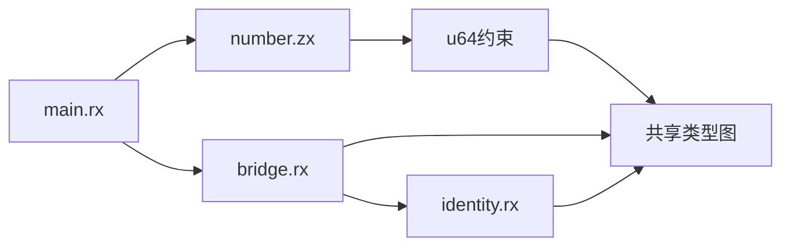
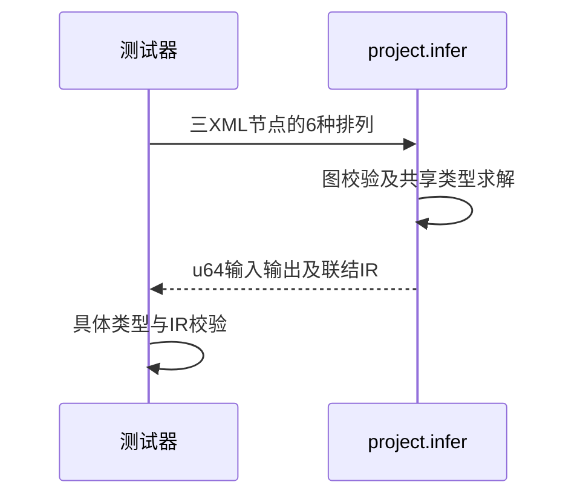

# RX项目三级调用推导顺序验证

## Intent：最终目标

阶段274：通过新project.infer入口验证未声明输入输出类型的三级RX调用，所有模块登记顺序必须得到相同具体类型。

## Data：可用证据

当前project.zig已导出，先validateModules，再共享约束，最后按依赖顺序lower。入口调用number.zx取得u64；bridge与identity仅透传，类型须来自跨模块约束。三个XML均真实解析。

## Edges：边界与限制

实现会话仍在开发，先独立复现，不能从源码存在推断可运行。这里只校验推导及完整IR，不声称生成代码已经执行。六个排列不代替任意图证明。

## Answer：交付与成功标准

穷举三模块6种登记顺序，输入输出均u64，最终IR有效；测试通过后纳入测试包。出现失败立即保留并通知实现会话。

## 实际结果

独立测试4/4构建步骤6/6通过；正式纳入packages/test/tests/rx/inference/project/order_test.zig及四个fixture，test-rx-inference总计4/4步骤55/55通过。三XML分别parseXml生成节点，未手写替代AST；infer返回具体u64输入/输出，program包含函数且通过完整IR校验。

格式和本次diff检查通过；独立/正式日志与验证后的project源文件哈希保存。结果已同步实现会话。独立RX推断55、运行47；JSONL64,292和上游1,212审阅未变化。

## 自我批判

六排列是三个模块的完整登记排列，不是任意模块图或所有调用顺序的穷举。本例一条传递链，尚未验证共享菱形调用者提供不同可选约束、名义类型冲突、项目分配失败或生成代码实际执行。不能从IR校验通过宣称业务结果已运行。未修改生产源码，没有全仓回归或UI验证。
