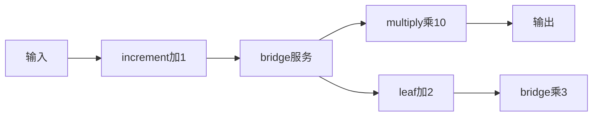
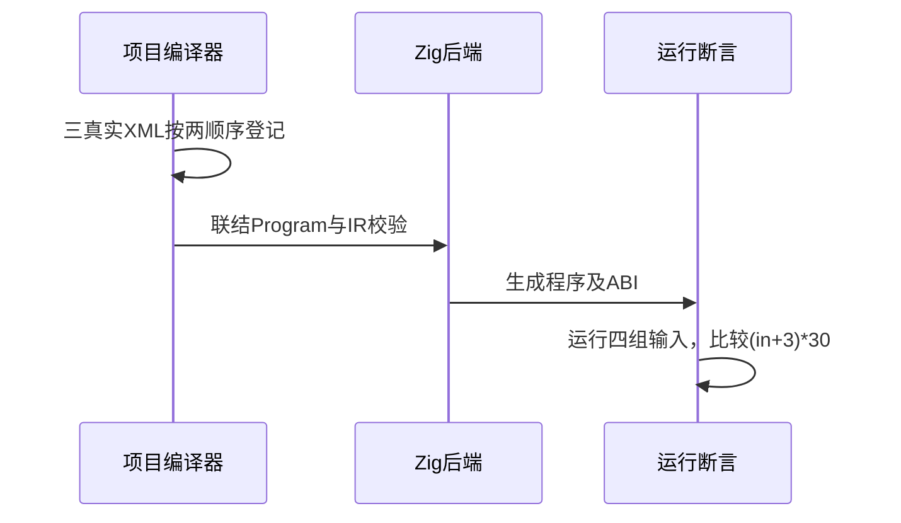

# RX项目三级调用真实执行验证

## Intent：最终目标

阶段275：把已通过类型推导的RX项目三级服务调用生成并运行，验证每层计算与模块登记顺序无关。

## Data：可用证据

新project.infer返回联结Program；沿用runtime工具emitBundle→ABI→Zig测试路径。main先increment，再bridge服务，最后multiply；bridge调用leaf并乘3，leaf加2，预期为(in+3)*30。

## Edges：边界与限制

采用前向及反向登记两种生成产物，输入运行时提供。数值选在u64安全范围内，不将整数溢出问题混入模块联结验证。顺序链不代表共享菱形、状态或宿主执行全部完成。

## Answer：交付与成功标准

两种产物各4个输入：0、7、31、最大安全乘法边界；实际结果逐项等于独立常量预期，完整RX运行套件通过。IR校验与实际执行分别确认。

## 实际结果

完整test-rx-runtime构建43/43步骤55/55测试通过；新增8项来自两种模块登记生成产物，每个产物4个独立运行输入。结果0→90、7→300、31→1020，以及floor(maxU64/30)-3→floor(maxU64/30)*30，精确整数断言通过。

新增compile_project.zig只负责项目集合真实解析、项目推导、IR校验及emitBundle，原单模块工具保持职责。构建根据受控project模式选择编译工具，共享既有ABI编译与执行注册，三RX/两ZX通过embedFile跟踪。格式与本次diff检查通过；源码草稿、日志、实现哈希保存。

结果已通知实现会话。独立RX运行55、推断55；JSONL64,292、上游1,212均未变化。

## 自我批判

两个登记顺序产物是两个实际编译场景，4个输入形状不宣称新增8个不同语言规则。各层算术有独立贡献，能检出跳过或错误重排本链，但没有测试共享子模块、状态、宿主调用、项目资源失败或错误跨服务传播。最大值选择为安全域边界，不掩盖溢出策略也不把它当溢出测试。没有生产修改、全仓回归或UI验证。
