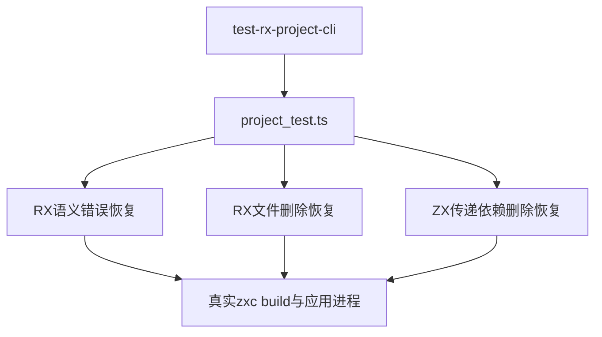

# RX项目依赖修复重建验证

## Intent：最终目标

阶段284：验证同一磁盘项目在RX错误、RX依赖删除、ZX传递依赖删除后，能保留已发布应用，并在修复后生成最新行为。

## Data：可用证据

阶段283已验证成功构建和错误保护，尚未验证失败后的恢复。本轮沿用project_test.ts的真实CLI子进程、临时目录与哈希断言；既有ZX watch恢复用例作为行为参照。

## Edges：边界与限制

本轮使用独立build命令，不能证明watch自动发现变化。修复同时更新ZX helper的计算值，用运行结果辨别是否仍使用旧产物。只添加测试，不修改生产实现。

## Answer：交付与成功标准

三个独立生命周期各覆盖首次构建、破坏依赖、失败后哈希和旧行为、恢复依赖后新行为。完整RX CLI专项、类型与格式检查通过，并保存日志与测试快照。

## 架构图

## 数据流图

## 验证结果

`zig build test-rx-cli --summary all`退出0，12/12构建步骤成功；既有11项场景与项目9/9测试通过，累计20项CLI场景。新增三种恢复分别约14秒。`npm run typecheck`及本次diff空白检查通过。未修改Zig文件，沿用上一阶段已通过的构建注册。

所有恢复用例均验证输入7由原结果20变为32，输入0得到18；失败阶段原应用SHA-256不变且仍返回20，恢复后源文件内容与预期一致。没有发现实现缺陷，未通知实现会话。

## 自我批判

结果证明独立CLI进程在失败后能够重新读取修复文件并构建新行为，不证明长驻watch进程的失效追踪，也不证明中断写入时的发布原子性。三个用例复用同一小型项目以隔离不同故障来源，没有把每次命令和断言计成独立案例。本轮未跑全仓回归，不更新全仓通过基线。
