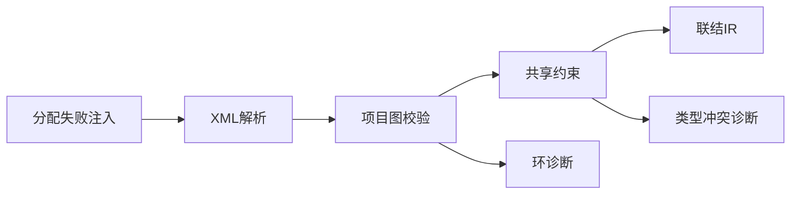
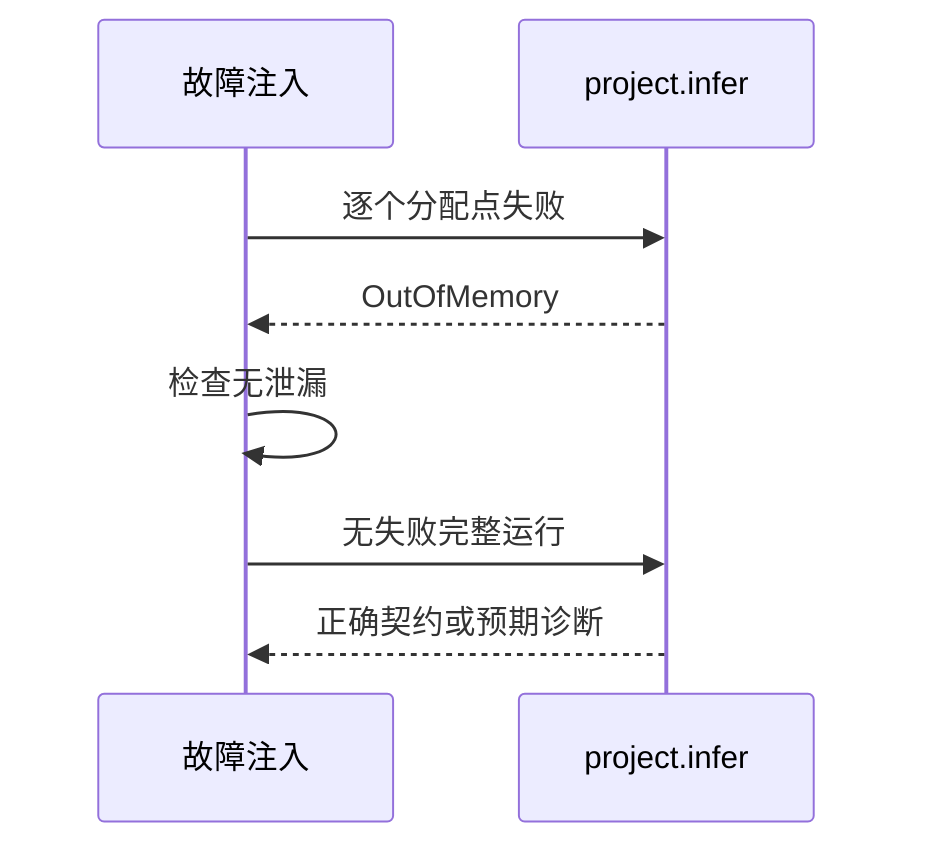

# RX项目分配失败验证

## Intent：最终目标

阶段276：逐分配点验证项目推导资源释放，覆盖成功三级链、共享服务类型冲突、循环依赖诊断。

## Data：可用证据

成熟单模块资源测试使用std.testing.checkAllAllocationFailures；项目API增加图校验、共享类型图和逐模块lower，应单独覆盖其生命周期。沿用真实XML三级链fixtures。

## Edges：边界与限制

每次失败必须传播OutOfMemory，不能转换成普通业务诊断。正常运行的冲突/环需保留type_mismatch/context诊断。只穷举这三条确定路径的分配点，不宣称所有内存行为覆盖。

## Answer：交付与成功标准

三项逐分配点检查全部通过，成功路径具体u64类型与IR有效；诊断路径错误码和环消息正确；testing allocator无泄漏。通过后纳入正式推断套件，若失败保留日志并通知实现会话。

## 实际结果

独立4/4步骤3/3通过，正式纳入project/resources_test.zig，完整test-rx-inference构建4/4步骤58/58通过。成功路径u64输入输出及IR有效；数字/字符串共享服务冲突报type_mismatch；main与bridge环报context，路径bridge.rx且消息包含circular。三条路径逐分配点故障注入通过，testing allocator未报告泄漏。

格式和本次diff检查通过，独立/正式日志与验证后实现哈希保存。独立RX推断58、运行55；JSONL及Test262审阅计数不变。用户在执行中明确要求仅发现实现问题才通知实现会话，故正式通过结果不再发送。

## 自我批判

逐分配点覆盖的是三条具体执行路径，arena向底层申请内存的失败点也不等价每个逻辑对象分配。不能从3项通过宣称任意模块图无泄漏、所有资源失败均已覆盖。测试同时检查正常运行语义，避免仅验证错误返回而遗漏错误诊断。没有生产源码修改、全仓回归或UI验证。
