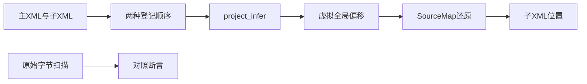
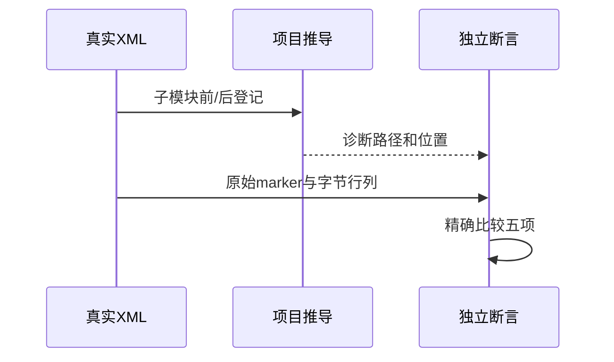

# RX项目子模块诊断定位验证

## Intent：最终目标

阶段279：验证project.infer错误路径及位置来自实际出错子模块，跨模块虚拟偏移、XML实体和换行均正确还原。

## Data：可用证据

沿用单模块定位测试的独立原始字节扫描方法。入口与子模块真实parseXml；分别将子模块登记在首尾，验证SourceMap虚拟范围不泄漏到对外位置。

## Edges：边界与限制

位置检查采用字节列而非Unicode字符列，与当前诊断契约一致。八场景每个执行两个登记顺序，不宣称任意错误路径均已覆盖。只测试project.infer诊断，不涉及CLI渲染。

## Answer：交付与成功标准

名称、中文CRLF实体、多行属性、表达式末尾syntax、非法绑定、目标缺失、两节点环和自环诊断，全部检查code/path/offset/line/column。独立通过再纳入正式套件，发现实现问题才通知。

## 实际结果

8个测试分别执行两种登记顺序，共16次完整项目诊断位置检查；独立4/4步骤8/8通过，正式纳入project/position_test.zig，推断套件4/4步骤70/70通过。所有code、规范化模块path、原XML字节offset、行及字节列精确匹配。

初次6/7通过：两节点环的反向登记会在main引用child处闭环，而初始预期错误地要求child引用main处。按模块图遍历契约分别校验对应边，不放宽为任意路径或忽略位置；另新增子模块自环在两顺序下固定落在child的对照。初次失败日志保留，此为测试预期修正，无实现缺陷。

格式及本次diff检查通过，独立/正式日志和实现哈希保存。独立RX推断70、运行75；JSONL与上游计数不变，未发送通过消息。

## 自我批判

不存在天然唯一的两节点环“错误模块”，必须按返回闭环边检查其原始位置；不应将遍历起点差异误报为SourceMap错误。其余六类错误及自环都有独立原始marker，行列扫描不调用生产定位算法。测试仍只覆盖这些诊断路径，不能证明所有复杂约束冲突都选择最佳原因位置。没有生产修改、全仓回归或UI验证。
