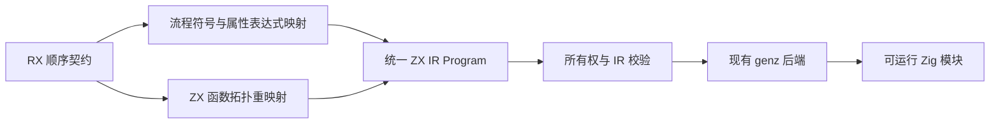
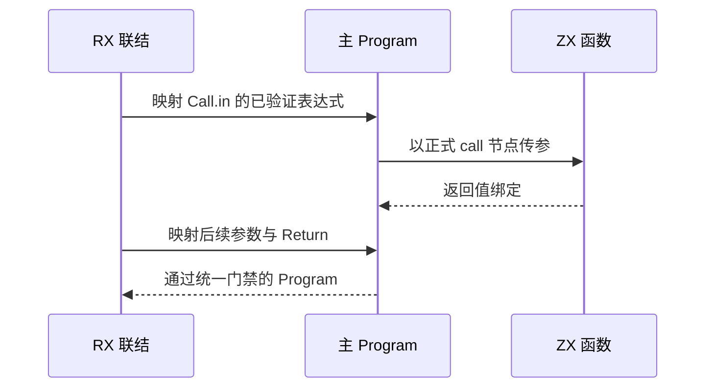

# RX 顺序模块执行联结计划

## Intent：最终目标

把已推导的 RX 顺序函数调用契约降为正式 ZX IR Program，交给现有 genz 后端生成可执行 Zig。保留既有聚合引用和所有权规则，不引入独立 RX runtime、不深拷贝业务对象。

## Data：可用证据

rx_analysis.module.infer 已输出各步骤的 argument/callee Program 与 Return Program，类型表和原生接口已统一。表达式 Program 使用编译器生成的环境 tuple 及开头的绑定投影，函数库保持拓扑次序。genz.zx 已能生成全部相关 ZX IR。现有 ArtifactNodes.function 可重映射导入函数和原生模块编号。

逐步创建环境 tuple 会按既有 IR 规则转移 owned 值，因此不能把所有流程变量重复装箱以规避检查。使用绑定符号映射将属性表达式内联到主 Program，函数调用仍保持正式 call 节点。

## Edges：边界与限制

仅连接已正式推导的顺序 Call.fn/Return，不跳过原有拒绝项。函数和表达式编号必须完整重映射，回调参数保持局部符号作用域，最终 Program 必须通过正式 IR 和所有权检查。导入函数保留契约、外部声明及源码位置。生成行为留在 genz，语义联结留在 compiler。

不新增测试、不调用浏览器、不跑全量测试。使用既有真实示例与通用检查器执行编译链，测试回归由另一会话负责。实际编译、运行证据不足时不得声称 CLI 或完整流程运行时已完成。

## Answer：交付格式与成功标准

新增 rx_analysis.module 的可执行 Program 交付，并在生成入口复用现有 genz；已有 function.rx 依赖示例最终通过真实 Zig 执行得出正确结果。公开参考记录接口、所有权及暂未接入的流程范围。每个完成的大功能提交并推送。





## 实施与自我复核

已实现 `Contract.program`，使用 compiler 内部的 program/builder、expression、mapping 三个职责模块构建标准 ZX IR。genz 未新增 RX 专用分支；仍复用既有调用、语句、类型和聚合值代码生成。

所有权错误和最终 IR 错误现在通过原始 RX AST 的属性位置映射回真实行列，避免已知 offset 却固定报 1:1。只读复核确认函数拓扑编号、原生模块恒等映射前提、lambda 符号与参数环境投影保持一致，未发现可确证的错联结。

通用检查器新增 `--emit <输出路径>`，仍接收真实 RX 与 ZX 源路径。当前检查器构建 4/4 成功。已有 function.rx → calculate.zx → add_one.zx 经真实解析、推导、统一 IR 门禁和 Zig 生成，生成源码在本功能目录的验证/program.zig；使用现有 CLI runner 编译为实际可执行文件，输入 41 得到 42。

```sh
docs/2026-10-04/RX显式函数调用/zig-out/bin/inspect-rx-module docs/2026-10-03/RX依赖装载示例/function.rx --emit docs/2026-10-04/RX顺序模块执行/验证/program.zig docs/2026-10-03/RX依赖装载示例/calculate.zx docs/2026-10-03/RX依赖装载示例/add_one.zx

zig build-exe -O Debug --dep application -Mroot=packages/cli/src/cli/runner.zig -Mapplication=docs/2026-10-04/RX顺序模块执行/验证/program.zig -femit-bin=/tmp/zxc-rx-sequential-example

/tmp/zxc-rx-sequential-example 41
```

### 自我复核

已证实真实示例可执行，未把此结果扩大为完整 RX CLI、service、分支、事件或 Store 支持。现有 zxc build 的 RX 入口装载尚需连接；带原生模块的发布路径、证明门禁及缓存仍须按正式 CLI 的既有机制接入。编译器生成结果继续经过形式化契约门禁，不直接绕过 compiler 后端去调用 genz。

本会话未新增或运行测试、未调用浏览器。另一测试会话已报告基础、分配失败、原始诊断位置和结果绑定累计 30 项通过，并在继续独立验证生成结果；这些基础结果不能替代本阶段的实际运行值证据。

### 独立执行结果补充

测试会话阶段 251 已完成另外 10 项真实生成代码运行验证：真实 XML/ZX → infer → validateIr → emitBundle → Zig 编译 → execute；和既有 30 项契约检查一起为 15/15 步骤、40/40 通过。已阅读其执行记录确认覆盖范围。

动态输入验证 increment→multiply 的非交换调用顺序、相邻 ctx.a/ctx.ab 与同函数重复导入。被丢弃的调用通过空列表导致 IndexOutOfBounds 的对照证明仍执行并传播错误。ASCII、中文/emoji 和空字符串的借用返回保持输入指针及内容。该借用证据针对原输入拥有数据的场景，不表示所有返回值可在执行 arena 释放后使用。

本会话未执行上述测试，也未执行全量测试。完整 CLI、service、Store、分支、事件和 Gateway 仍待接入。
