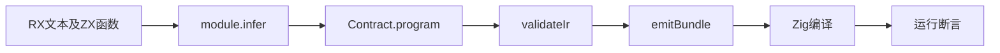
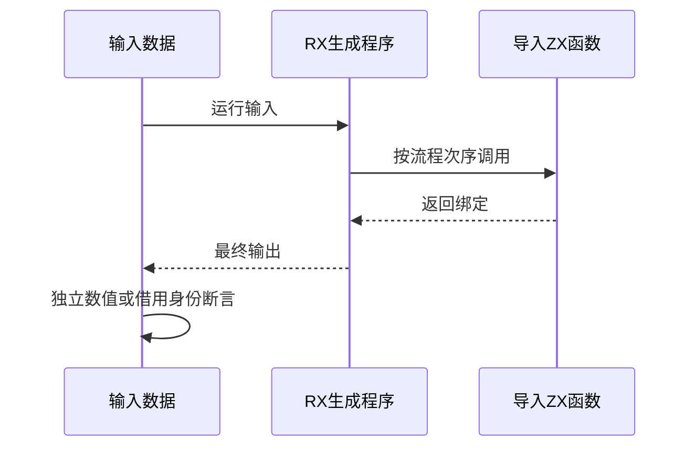

# RX顺序流程真实执行验证

## Intent：最终目标

阶段251：独立验证新Contract.program经过现有Zig后端后能够实际执行顺序RX流程，补足类型/IR通过与运行正确之间的缺口。

## Data：可用证据

当前module_compile调用program.lower并进行所有权与IR验证；Contract新增program。成熟样例为tests/expressions/runtime编译器工具与构建，支持emitBundle共享ABI。

## Edges：边界与限制

范围限定顺序Call.fn/Return。没有Gateway、Store、事件、分支流程执行，不编辑生产实现。编译器工具读取真实XML文本与ZX函数fixture；输出由真实生成代码执行得到。

## Answer：交付与成功标准

顺序模式验证先加一再乘十、相邻ctx.a/ctx.ab、再次调用但丢弃结果后保留原绑定；借用模式检查返回字符串内容及释放arena后仍指向输入。保留生成器和实际运行日志；发现差异通知实现会话。

## 实际结果

新增test-rx-runtime并接入总test入口。三个真实XML模块与四ZX函数fixture，通过parseXml→module.infer→Contract.program→validateIr→emitBundle→Zig编译→execute，10/10运行测试通过。连同既有30项自动契约测试一起执行：15/15步骤、40/40通过。

顺序模式五输入0、1、7、99、100000分别输出11、22、88、1100、1100011，对应先increment再multiply以及最后ctx.a+ctx.ab。再次调用increment但丢弃结果后，两原绑定仍正确。此模式还覆盖同一函数多次导入到流程Program的编号映射。

借用模式ASCII、中文含emoji、空字符串三输入全部内容相等，释放执行arena后输出指针仍等于输入指针。丢弃模式以非空列表成功返回true，空列表在被丢弃的first调用中产生IndexOutOfBounds并传播，不能跳过该调用直接Return true。

格式与本次构建注册diff空白检查通过。新增10项属于真实生成代码的独立Zig运行测试，不计JSONL目录；目录64,145与Test262上游1,047保持不变。测试源码、构建草稿、执行日志及实现SHA归档，并通知实现会话。

## 自我批判

只检查纯函数最终数值无法证明被丢弃调用执行，因此增加了可捕获索引错误的成功/失败对照。此前考虑除零，但其整数安全失败形式不适合作为本组错误联合断言，未据此构造不可靠的通过标准。

新公开Contract.program仍处于开发中，本轮证明当前快照这三种顺序流程可以真实运行，不扩大到service模块组合、分支、Store、事件和Gateway。借用检查证明这三输入的身份与生命周期，不等于所有聚合所有权已验证。没有全仓回归、生产源码编辑或浏览器检查。
