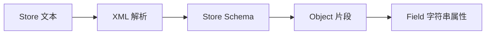
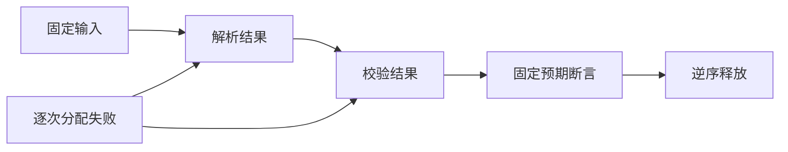

# Store 真实文本契约验证

## IDEA

- Intent：通过真实 XML 文本验证 Store 定义、对象片段与字段唯一性，补足版本边界和资源失败证据。
- Data：Store/Object/Field 当前 Schema、已有合成 AST 测试；version 为 u32；同名 Object 允许不相交字段。
- Edges：Field 的 type/value 仍是字符串；本轮不声称执行类型解码、初值解释或 Store 生命周期联结。分配失败检查针对具体输入轨迹。
- Answer：独立命名 Zig 测试、现有文本专项登记、实际结果、自我批判。XML 负例与 Schema 负例分开，后者先确认解析成功。

## 执行计划

1. 草稿编写合法数据与版本边界案例。
2. 编写字段、嵌套、同名片段冲突和文件身份拒绝案例。
3. 验证成功与失败路径分配释放，执行文本专项，更新记录。

## 架构

## 数据流

## 执行结果

新增 35 个独立命名测试：29 个结构拒绝、1 个合法片段数据检查、2 个版本边界、2 个逐次分配失败、1 个实体解码后重名的 CRLF 诊断位置。

同名 Object 的不相交字段、不同 Object 中同名字段均被接受。字符串空初值与实体解码后的值保留。重复字段和跨片段完整路径被拒绝；`x` 与 `&#120;`、`state` 与 `st&#97;te` 的解码后名称身份一致，诊断仍定位到第二处原始值。

`zig build test-rx-text --summary all` 退出 0，19/19 步骤、120/120 测试通过，日志 `/tmp/zxc-store-text-final.log`。格式、diff 与草稿一致性检查通过。无生产源码修改，无需发送新缺陷通知。

JSONL 57,745，上游 328/53,597 不变；最近完整根回归仍为阶段 90，本轮只执行相关专项。

## 自我批判

- 初值以字符串保留的断言不等于初值符合声明类型；当前 type/value 的语义连接仍不能由 Schema 成功推断。
- 两条分配失败轨迹证明这些固定输入清理正确，不证明全部 Store 工作负载的资源行为。
- 片段身份采用当前精确名称比较，未外推 Unicode 规范化、大小写折叠或字段路径转义规则。
- 这些新增测试推进 zxc 自有特性覆盖，没有推进 Test262 上游文件审阅数，整个目标仍未完成。
