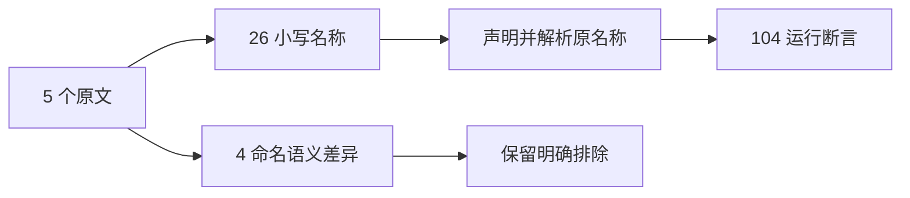
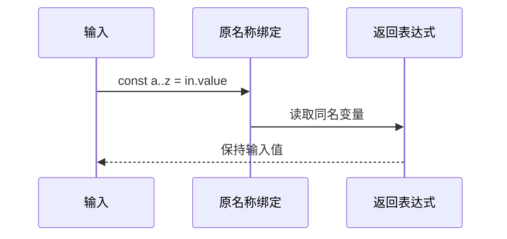

# Test262 ASCII 标识符绑定验证

## Intent：最终目标

阶段三百二十六：保留原始ASCII标识符，验证有效小写值绑定及JS与ZX的命名边界。

## Data：可用证据

读取5个原文。26个英文字母小写绑定可表达；美元名称、前导下划线和大写值名与ZX命名约束不同。独立CLI探针对美元和下划线9种形式确认naming/syntax差异，源码命名规则来自packages/lint。

## Edges：边界与限制

1 adapted、4 excluded。原文var改const，初值改运行输入但保留a至z原名称，输入包含原值1与0、42、u64最大值。每个分支声明并返回自己的变量，不以直接return in跳过名称绑定。

## Answer：交付格式与成功标准

26原名称×4输入=104执行断言；原文哈希与参考执行、生成器、矩阵和ASCII标识符专项通过。不通过重命名非法原名称获得虚假支持。

## 自我复核

原文26个绑定而非字符范围推测；新测试逐个声明实际名称。前期宽检索输出过多后只选5个完整读取文件，其余未读完的标识符文件不计审阅。

## 验证结果

运行 `zig build test-ascii-identifiers --summary all`：13/13步骤、104/104测试通过。5原文哈希和正文核验、10次参考执行通过。生成器重复性、矩阵、格式及diff检查通过。

首次夹具case多加了当前不支持的裸块包装，按既有分支结构移除后通过，原名称和断言均不变；保留首次失败日志，不把夹具问题上报为实现缺陷。另以本次构建CLI复核9种美元/下划线及大写A共10个命名差异探针。

JSONL65034（runtime47539），已审阅1919=658 adapted+103 equivalent+1158 excluded，未审阅51678，关联4896。未改生产实现、未通知实现聊天、未重跑完整根回归。
