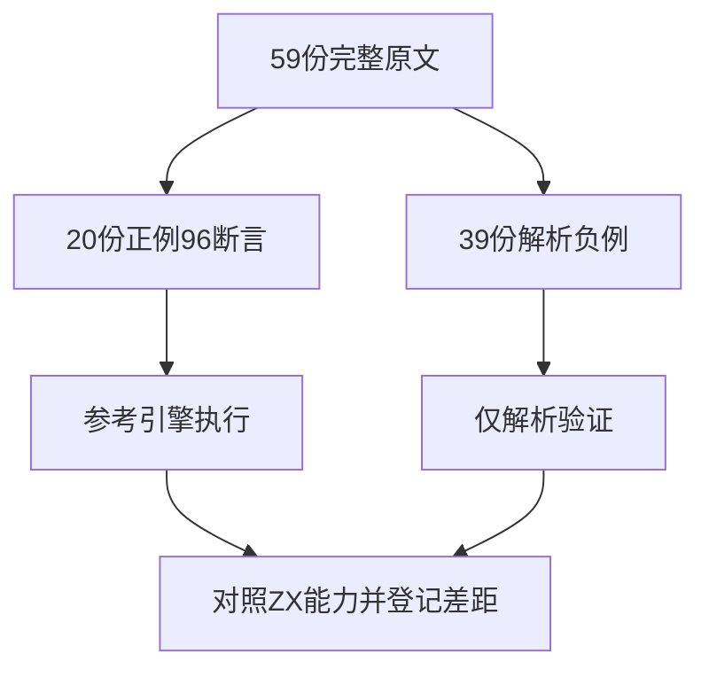

# Test262 BigInt字面量完整审阅

## Intent：最终目标

完成BigInt字面量目录59份原文的语义判定，避免把ZX的定宽整数能力、内部大整数检查工具或统一拒绝误报为BigInt支持。

## Data：可用证据

只读子代理分三批完整读取59份，得到20正例、39个parse/SyntaxError负例；没有flags或额外includes。20正例96条sameValue，其中84条BigInt、12条Number。主流程复核混合十六进制文件和命名nzd但实际以0__开头的负例。当前lex.zig、numbers.zig、types.zig没有BigInt字面量或公开类型；内部u1024仅用于整数转浮点的精度检查。

## Edges：边界与限制

59份均excluded。六份十进制正例中的有限数值虽然可用u64/i64表示，删除n后缀也不证明BigInt类型和任意精度支持，因此不靠子集改写增加适配数。这里不新增重复的定宽整数测试；既有数字分隔符与前导零测试继续代表ZX自身契约。

## Answer：交付与成功标准

全部原文SHA和主体核对，先验证参考Node确实支持BigInt、数字分隔符及超安全整数精确比较，再执行40次正例和78次仅解析拒绝。目录审计通过，保存每份排除原因、异常与原始执行结果。

## 关键异常

- hil-od-nsl-od-one-of包含后12条无n的十六进制Number，不能按目录或文件名统一认定BigInt。
- nzd-nsl-dds-dunder-err实际为0__0123456789n，有前导零与重复分隔符重叠。
- exponent-part的0e0n非法是BigInt专属约束，去掉n后的ZX指数形式可以合法，不能沿用原负例。

## 自我复核

本阶段是覆盖判定与证据完善，没有宣称新增ZX BigInt实现或新的执行案例。参考引擎通过数、正式测试数和上游排除数分别记录；59份审阅完成仍保留实际能力缺口。

## 阶段305实际结果

参考引擎BigInt与精度前置对照通过，59份原文SHA/主体、78次仅解析拒绝及40次实际执行通过，20份正例96条原始断言数量独立核对。全部59份按原始协议明确excluded，目录审计通过。

JSONL64,646与关联4,549不变；上游1,440/53,597（619适配103等价718排除），未审阅52,157。BigInt目录59/59已审阅，原始能力缺口仍存在；没有新增ZX测试或生产变更，不重复前端/根回归。未向实现会话发送消息。
