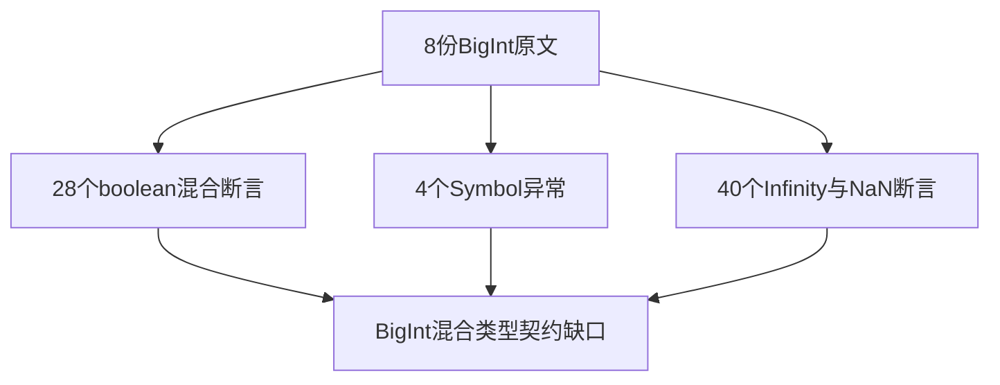
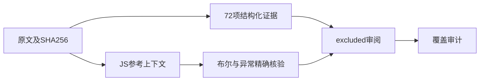

# Test262BigInt混合关系比较审阅

## Intent：最终目标

逐项审阅BigInt与布尔值、Symbol、Infinity和NaN的关系比较，明确与ZX固定宽度数值契约的差异。

## Data：可用证据

固定Test262提交7ab7fafa0003f73fc85c1b95d88094d33f7eb8bd。完整阅读8份原文，共72个断言：28个布尔混合比较、4个Symbol异常、40个非有限值比较。各原表达式与布尔值/异常类型保存为结构化证据。

## Edges：边界与限制

本批BigInt值大多可放入固定宽度整数，但这不允许替换类型后宣称BigInt通过。普通f64 NaN/Infinity回归也不证明BigInt与Number混合比较。全部excluded，参考JS执行不计为ZX通过或新增用例。

## Answer：交付格式与成功标准

8条带原哈希与具体差异的审阅记录；参考执行核对全部72断言，包括异常构造器身份；审计通过，四类关系比较剩余未审阅数准确更新。

## 执行结果

8份原文、72个断言全部参考执行通过：28个BigInt/boolean，4个BigInt/Symbol的TypeError，40个BigInt/Number非有限比较。参考执行为每份文件建立独立JS上下文并限制1秒；异常检查比较实际异常构造器与原文传入TypeError，未仅比名称或消息。日志 `/tmp/zxc-relational-bigint-mixed-reference.log`。

每个比较表达式、预期布尔值或异常类型均已保存，SHA256、断言执行次数与证据条数一致。不存在的<=/>= boolean或Symbol文件没有被虚构。目录审计通过，日志 `/tmp/zxc-relational-bigint-mixed-audit.log`；审阅草稿与正式JSONL逐字节一致、diff通过。

上游641/53597（425 adapted、103 equivalent、113 excluded），未审阅52956；目录63323和关联3829不变。本轮不新增ZX测试或通过数。四个关系运算目录各剩5份，共20份：BigInt自身、字符串、不可比较字符串、Number及数值极端边界，列表保存在剩余文件.json。

## 自我批判

这些小BigInt样本即使可写成i64也不能改变其类型来宣布对齐。BigInt与Number的混合比较需要保留两类数值的语义；普通浮点测试和静态拒绝无法替代。NaN在<=和>=中仍为false，不能按另一比较结果简单取反。

本轮是原文边界审阅和JS参考核对，未实现BigInt；excluded是缺口登记，不是功能完成。未修改生产源码、未重跑无变化的ZX套件或全量回归。
