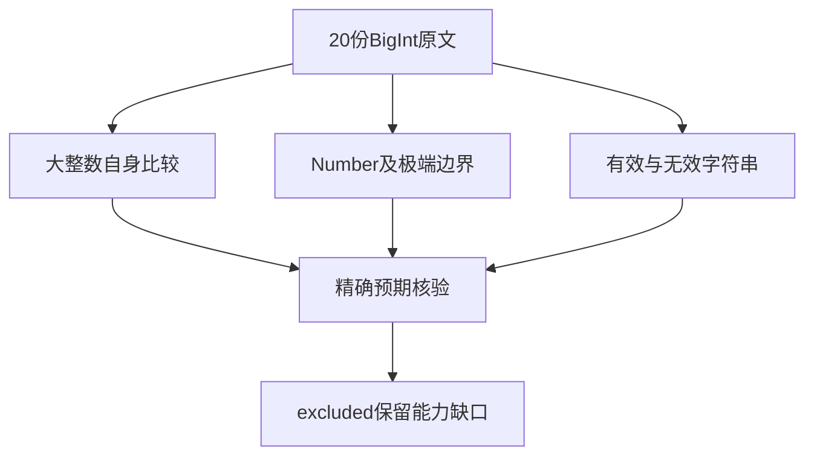

# Test262BigInt精确关系比较审阅

## Intent：最终目标

审阅四类关系运算剩余20份BigInt文件，核对精确整数、Number边界和字符串转换，完成这些目录的逐文件覆盖检查。

## Data：可用证据

固定Test262提交7ab7fafa0003f73fc85c1b95d88094d33f7eb8bd。20份执行体仅含sameValue断言（已核对移除断言后的剩余内容仅注释和空白），全部438个实际表达式与布尔预期已逐项读取并保存。

## Edges：边界与限制

ZX不支持BigInt与相关隐式转换，全部excluded。JS参考执行、Python精确数学核验都不是ZX测试，不计入用例目录或ZX通过数。四个关系目录审阅完成不等于语义实现完成，也不等于全Test262完成。

## Answer：交付格式与成功标准

20条审阅记录，原文哈希与438项证据一致；JS原文参考执行和整数/精确分数独立预期核验通过；重新枚举四个目录确认未审阅数为0，并按分类保留缺口。

## 执行结果

20份文件共438条断言：BigInt自身132、有效字符串114、无效字符串80、Number混合80、Number极值32。原式有430个不同表达式，8个重复来自原字符串文件，全部保留但不夸称438种不同输入。

JS参考执行20份全部通过，实际sameValue次数438，日志 `/tmp/zxc-relational-bigint-precision-reference.log`。Python独立核验也通过，日志 `/tmp/zxc-relational-bigint-precision-exact.log`：BigInt使用任意精度整数，Number小数字面量先按IEEE64解析再转Fraction保存精确值；MIN_VALUE使用1/2^1074，MAX_VALUE使用(2^53-1)*2^971。确认原1024位极端BigInt恰为MAX_VALUE减1与加1，未先转为浮点数抹掉差异。

字符串空串按BigInt转换为0，有效二/八/十六进制与十进制文本精确解析，无效n后缀/小数/指数/Infinity等文本使比较结果为false而非抛错。四种关系运算分别计算，不通过简单取反处理不可比较输入。

20条excluded与证据逐字节一致，所有原文哈希、执行体抽取完整性、断言次数及布尔结果一致。目录审计通过，日志 `/tmp/zxc-relational-bigint-precision-audit.log`。上游661/53597（425 adapted、103 equivalent、133 excluded），未审阅52936；目录63323和关联3829不变。本轮没有新增ZX测试或通过数。

## 四类关系目录覆盖核对

| 目录 | 文件数 | adapted | equivalent | excluded | 未审阅 |
| --- | ---: | ---: | ---: | ---: | ---: |
| less-than | 45 | 26 | 8 | 11 | 0 |
| greater-than | 49 | 26 | 8 | 15 | 0 |
| less-than-or-equal | 47 | 26 | 8 | 13 | 0 |
| greater-than-or-equal | 43 | 26 | 8 | 9 | 0 |
| 合计 | 184 | 104 | 32 | 48 | 0 |

逐文件枚举结果保存为关系目录覆盖.json，不能将184份“审阅完成”写成184份“等价执行通过”。adapted中包含明确的静态拒绝，excluded中包含未实现协议与BigInt。

## 自我批判

独立数学核验确认原预期和边界，但它不是ZX编译器，也未实现目标语言BigInt。固定宽度数值可以覆盖部分数值大小，无法替代任意精度与跨类型转换；本轮保持excluded而不是缩窄目标后声称通过。

本轮只使关系比较目录的审阅范围闭合，全Test262还有52936份未审阅，全部语言与RX特性也仍需测试。无生产修改、未重跑无改动的ZX套件或全量回归，既有失败状态不变。
