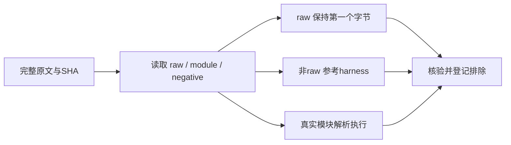
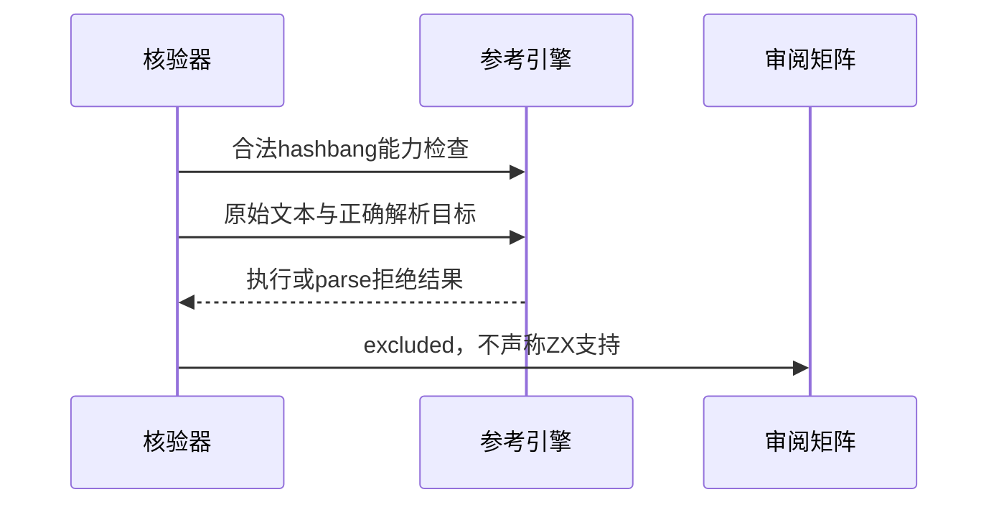

# Test262 Hashbang 原文审阅

## Intent：最终目标

阶段三百二十：核验 comments/hashbang 全部29个原文，明确 source-start 特殊注释与普通注释的差异。

## Data：可用证据

逐文件读取锁定原文并对照 SHA。多数文件带 raw，实际用例位于元数据之前；不能只取元数据后的正文，不能在 raw 前添加 harness 或严格模式指令。module.js 同时标记 module 与 raw，须以真实模块解析和执行。

## Edges：边界与限制

ZX 词法器不支持 hashbang。其转义、非开头位置、函数体和构造器负例不能因统一拒绝而计作适配。保留全部原文本，29项 excluded，不新增伪等价拒绝用例。

## Answer：交付格式与成功标准

新增逐文件排除记录；参考验证器 raw 单次原文执行/解析，非raw按照默认普通和严格模式，module 使用 SourceTextModule。先用合法脚本和模块 hashbang 验证参考能力，再运行负例；完成后矩阵审计。

## 自我复核

此阶段完成上游分类，不增加语言能力或ZX运行测试数。保留源文本开头是核验有效性的必要条件，不沿用会统一前置harness的普通探针。

## 核验结果

29 个完整原文 SHA 和内容核验通过；14 次原文执行、21 次仅解析拒绝通过，其中包含1次真实模块执行。脚本和模块两项合法 hashbang 能力守卫先通过。Node 使用实验 VM Modules API 的提示已保留于日志，不影响执行结果。

矩阵审计通过：已审阅1845=637 adapted+103 equivalent+1105 excluded，未审阅51752；JSONL64887和关联4749均不变。comments目录无未分类文件，但不代表全部注释语义已支持。

本次只增加审阅数据，未改生产代码、未重跑ZX专项或完整根回归，也未发现需发送实现聊天的缺陷。
