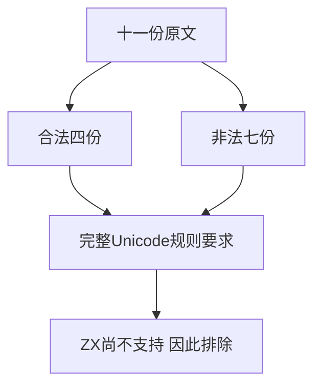
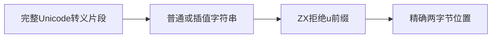

# Test262Unicode转义差距验证

## Intent：最终目标

核对十一份A7 Unicode转义原文，防止将不支持的语法被统一拒绝误记为完整的合法性检查。

## Data：可用证据

四份正例覆盖四位转义解码和尾随字符，七份parse负例覆盖非十六进制位及长度一至三位。已逐份阅读原文；当前ZX词法在u前缀统一拒绝，既有unicode_empty/unsupported separator不能证明支持Unicode转义。

## Edges：边界与限制

十一份全部excluded，包括七个JS负例。双方都拒绝不是充分的同语义证据：ZX连合法对应形式也不支持。新增两种合法JS形式作为ZX拒绝对照，不为整套字符表重复造例。

## Answer：交付与成功标准

原文SHA与主体、14次仅解析拒绝和8次实际执行通过；普通/插值下完整u0000/u0041共四项词法断言，完整前端、生成、类型、审计与格式通过。

## 自我复核

单纯将JS parse负例转换成任何ZX错误会产生虚假对齐；本批显式保留正反例共同定义的语义边界。不声称新增拒绝断言就是Unicode支持。

## 阶段301实际结果

十一份原文SHA/主体、14次仅解析拒绝与8次实际执行通过。完整前端退出0，5/5步骤、5,230/5,230通过，新增4项完整Unicode转义拒绝对照。生成一致性、审计、类型、格式及diff通过。

目录64,616（前端5,230），上游1,355/53,597（612适配103等价640排除），未审阅52,242，关联4,534。没有实现缺陷，未发消息，未重跑完整根。
