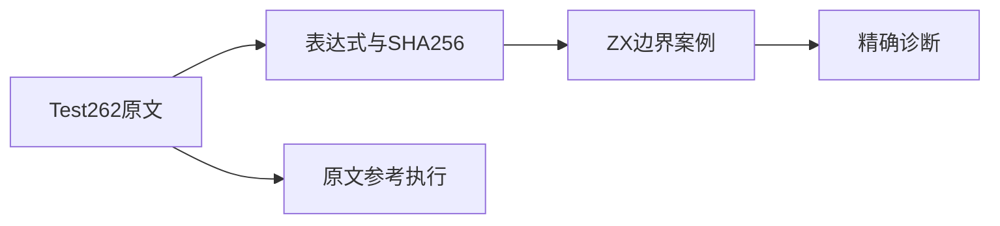
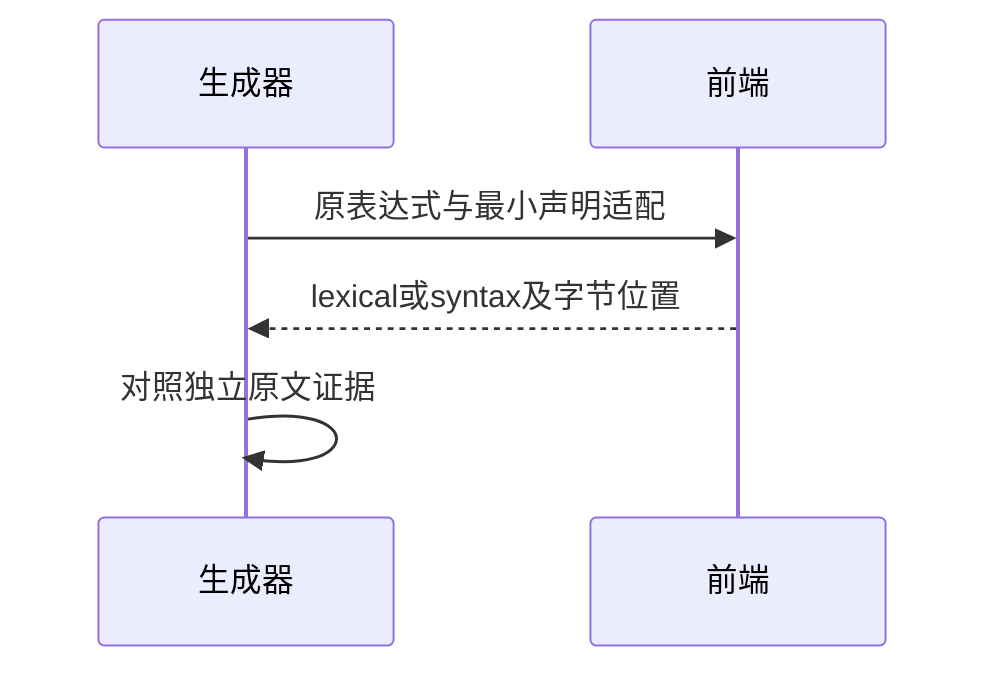

# Test262一元正号语法边界

## Intent：最终目标

审阅尚未登记的一元正号原文，以精确前端诊断记录ZX当前语法边界。

## Data：可用证据

固定Test262版本的S11.4.6_A1、A2.1_T1、A2.1_T2三份原文，共10条空白、5条取值及1条未绑定名称场景。ZX parser.primary目前只接受逻辑非与负号一元操作。

## Edges：边界与限制

用户已要求停止Context相关测试，本轮不新增、不运行这部分，不执行完整test入口。上游数值结果与ReferenceError不等于ZX的语法诊断。var与对象创建只作最小静态声明适配，不能据此声称支持JS对象协议。

## Answer：交付与成功标准

保留原文表达式、哈希及16场景证据；登记适配边界并运行限定一元正号的前端专项，精确检查阶段、诊断与字节span。另独立执行固定JS原文作参考核验。

## 实际结果

新增16个前端案例：12个syntax精确定位正号、4个lexical精确定位NBSP/Unicode行段分隔符首字节。上游错误消息中存在正负号和结果笔误，证据采用实际条件表达式；不按错误消息改写原测试。

限定命令 `zig build test-frontend -Dfrontend-filter=unary_plus_boundary --summary all`：5/5步骤16/16通过，日志 `/tmp/zxc-unary-plus-boundary.log`。生成器--check、TypeScript检查及目录审计通过，日志分别为 `/tmp/zxc-unary-plus-generated.log`、`/tmp/zxc-unary-plus-typecheck.log`、`/tmp/zxc-unary-plus-audit.log`。

独立参考脚本重新读取固定原文，检查3个SHA256、16个CHECK计数、逐项表达式一致性及原文VM执行，全部通过，日志 `/tmp/zxc-unary-plus-reference.log`；JS参考执行不计为ZX通过。草稿包含原文证据、参考脚本、生成器、案例与审阅记录副本。

目录63339（前端4784），上游已审阅664/53597（428适配、103等价、133排除），未审阅52933，关联3845。未增加生产语言能力，未修改编译器。

## 自我复核

本轮明确记录当前不支持的一元正号边界；这些16个拒绝案例不能代表JS一元正号语义实现。10个空白形态只是同一语法能力的不同词法边界，不把数量当作语言覆盖面。没有按Context旧计划继续测试，也没有运行任何包含它的完整入口。用户要求停止Context相关测试是后续执行约束，历史证据保留，不自动解释为用户授权删除文件。
