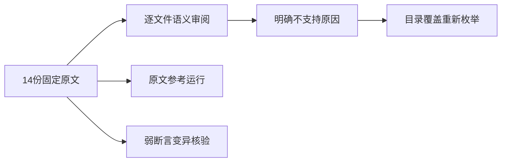
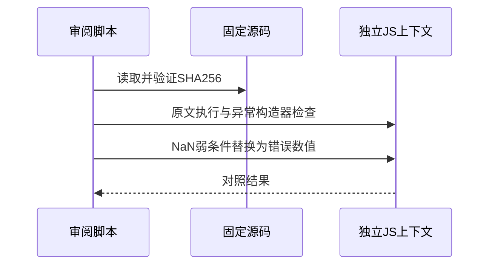

# Test262一元正号转换审阅

## Intent：最终目标

完成剩余一元正号目录逐文件语义审阅，明确动态转换、数值保持与异常的证据边界。

## Data：可用证据

已完整阅读固定版本14份剩余原文，包括58个CHECK/显式assert场景；原文SHA256和分段正文保存在同级证据目录。前一阶段仅验证语法拒绝，不能证明这些运行语义。

## Edges：边界与限制

ZX目前没有一元正号，亦无JS包装对象和动态ToNumber协议；不能通过去掉正号、替换固定宽度整数或静态对象冒充上游语义。停止Context相关测试的用户指令继续生效。

## Answer：交付与成功标准

14份登记为当前不支持，逐文件给出具体原因；原文参考执行核验哈希与58场景计数。对两个弱NaN条件做局部变异核验，重新枚举目录确认剩余审阅范围。JS执行和证据核验不计为ZX测试通过。

## 实际结果

14份原文58个场景参考执行通过，其中5个显式assert（1个sameValue、4个TypeError精确构造器），其余为原文CHECK分组。58是场景数而非统一断言计数；部分场景含多个条件。哈希与场景数均重新核对，日志 `/tmp/zxc-unary-plus-conversion-reference.log`。

独立变异将S9.3_A5_T2的CHECK3和CHECK5各自错误条件内转换值替为0，两次整份原文仍通过。这说明isNaN实际接收到!==true生成的布尔值，不能证明NaN。没有修改固定上游源码；变异只在隔离VM字符串中进行。

另外确认A3_T3的CHECK2实际构造Number而非String，S9.3_A4.1描述虽提MAX/MIN正文仅4个普通数值，S9.3_A5自定义ToNumber普通方法不参与标准valueOf/toString协议。正负零按Object.is独立核对参考结果，未用普通===掩盖符号。

重新枚举一元正号目录17份，3份已登记适配边界、14份排除、0未审阅。目录已审阅不等于功能实现。全上游已审阅678/53597（428适配、103等价、147排除），剩余52919；ZX案例63339、关联3845均不变。审计通过，日志 `/tmp/zxc-unary-plus-conversion-audit.log`。

## 自我复核

本轮未新增拒绝用例以重复证明一元正号语法缺失，也未把去掉正号后的数值恒等式当作实现。NaN弱断言的参考执行通过仅说明原脚本没有抛错，变异证据揭示了其验证不足。没有生产修改，没有运行Context或任何完整测试入口。后续需继续审阅其他行为族并补ZX实际支持能力，不以一个目录闭合缩小整体目标。
