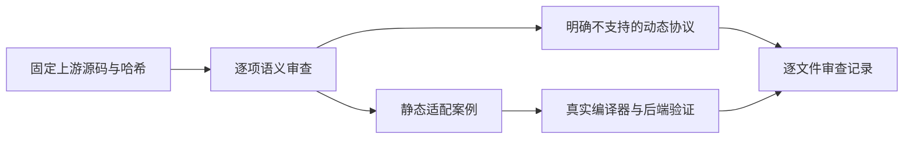
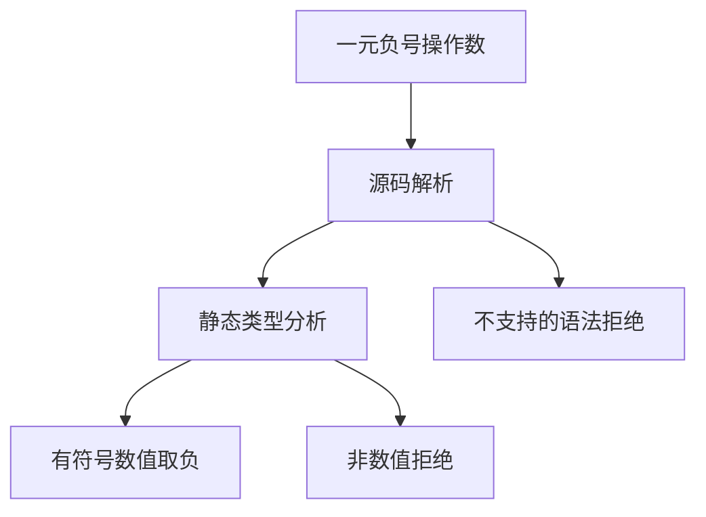

# Test262 一元负号转换边界

## Intent：最终目标

完成固定上游 unary-minus 剩余七个文件的逐项语义审查，补齐静态类型拒绝边界，保留上游数值与非数值转换之间的区别。

## Data：可用证据

固定版本 7ab7fafa0003f73fc85c1b95d88094d33f7eb8bd 的七个原文件已逐项读取；哈希将与索引核验。既有 generate_unary_minus.ts 已验证 bool、string 与普通对象类型拒绝，以及 IEEE 数值结果。

## Edges：边界与限制

ZX 无一般动态对象包装、valueOf/toString/Symbol.toPrimitive 转换协议，也无任意精度 BigInt。对混合文件只能记录 adapted 并明确未提供的包装机制，不能声称 equivalent。null 不转换成零；void 不转换成 NaN。原 function/void 运算符语法的拒绝与数值运算类型拒绝分开记录。

## Answer：交付与成功标准

补充真实前端诊断和括号数值执行案例，逐文件记录断言映射及差异。运行前端和执行专项、生成一致性及目录审计。生产缺陷通知实现会话。

## 执行结果与自我批判

新增 7 个前端拒绝边界及 1 个同形 `-(1)` 执行案例。前端与普通执行专项 **857/857 步骤、45,643/45,643 测试通过**，日志 `/tmp/zxc-minus-conversion.log`。TypeScript、生成一致性、目录审计和 diff 检查通过。没有生产源码修改或新实现缺陷。

七个原文件逐一哈希核验通过，审查新增 5 adapted 与 2 excluded。混合文件明确区分原始标量断言、静态拒绝和未提供的包装对象语义；纯 DefaultValue/ToPrimitive 及 BigInt 包装对象文件分别说明排除原因。unary-minus 目录查询未审阅数为零，但这不是 ECMAScript 兼容性全通过。

总计 57,121 登记案例：runtime 42,516、frontend 3,127、evaluation_order 332、safety 464、module_graphs 10,446、stores 236。上游 294/53,597 已审阅（163 adapted、102 equivalent、29 excluded），未审阅 53,303，唯一关联案例 975。本轮未重跑完整根，最近由本会话验证的完整根仍为阶段 75。

自我批判：将原转换操作改为编译期拒绝，只能证明选定静态契约的适配行为；不能证明原来的 NaN、零、异常优先级或对象身份行为。两个 excluded 文件已阅读各断言，未以目录名推断或批量排除。当前阶段没有为不支持的动态协议新增生产实现，遵循此前选定的静态 ZX/RX 设计范围。
