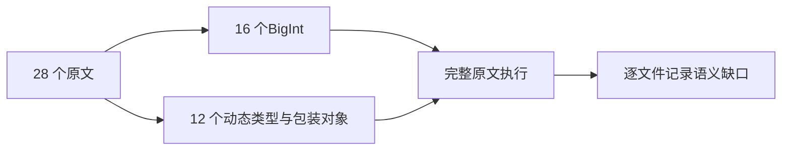
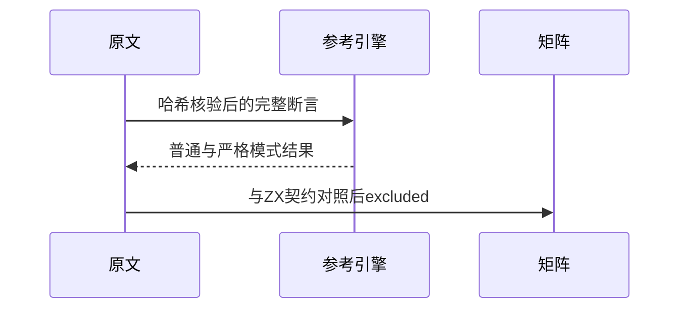

# Test262 严格相等剩余原文审阅

## Intent：最终目标

阶段三百二十五：核对严格相等和不相等目录剩余28文件，区分静态类型比较与JavaScript动态类型身份。

## Data：可用证据

16个BigInt文件覆盖同类型、与布尔/数字/非有限值/字符串/对象/其他primitive的比较；12个历史用例覆盖undefined、包装对象、跨原始类型、null与捕获异常值。

## Edges：边界与限制

ZX无BigInt、包装对象、undefined/eval、异常捕获等相同语义。静态拒绝混合类型不能充当原文false/true结果；不能删除BigInt后缀或截断成u64来支持原文。全28文件排除。

## Answer：交付格式与成功标准

逐文件SHA、正文、排除原因和参考执行证据；先验证BigInt精确值及类型身份参考能力，再使用官方harness普通/严格模式执行。矩阵审计通过，不新增伪等价ZX测试。

## 自我复核

第一次输出被截断后，另行读取全部实际条件与断言表达式，未只按文件名或features分类。参考核验执行完整源文，没有使用去掉错误消息的阅读摘要。

## 核验结果

28原文哈希与正文核验、56次完整原文执行通过，6个参考能力守卫通过。严格相等/不相等两个目录没有未分类文件，但包含明确未支持语义。

矩阵审计通过：已审阅1914=657 adapted+103 equivalent+1154 excluded，未审阅51683。JSONL64930、关联4792均不变；本次只新增审阅数据，没有新增ZX测试或重跑ZX专项。未改生产实现，未发现应向实现聊天报告的缺陷，未重跑完整根回归。
