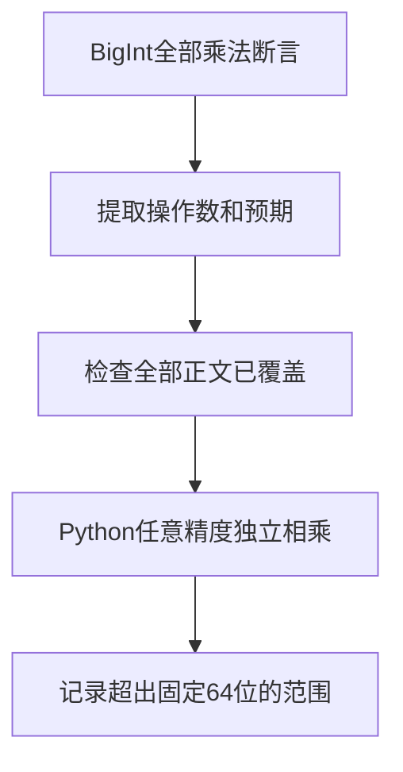

# Test262乘法剩余协议审阅

## IDEA

- Intent：完成乘法目录剩余八份原文件的逐项适用性审阅，明确当前ZX尚未实现的任意精度与动态转换协议。
- Data：锁定上游原文与哈希；当前IR标量只支持固定宽度整数及浮点，契约明确没有任意精度整数。
- Edges：excluded记录不是测试通过，不移除n或截断大整数冒充BigInt等价；普通宿主调用不能替代ToPrimitive/ToNumeric阶段。
- Answer：八份逐文件理由、全部BigInt算术独立核验、审计日志和目录剩余统计。




## 逐文件证据

| 文件 | 原始要求 | 当前边界 |
| --- | --- | --- |
| S11.5.1_A2.2_T1.js | 8项DefaultValue，valueOf优先、toString回退、返回对象、抛错与最终TypeError | 没有动态拆箱，不替换为字段读取 |
| S11.5.1_A2.3_T1.js | 左右valueOf均抛错时先执行左ToNumber | 普通调用顺序不能证明隐式转换顺序 |
| bigint-and-number.js | 20项BigInt与Number/包装/NaN/Infinity/bool/string/null/undefined混合TypeError | 无BigInt及ToNumeric动态类型分派 |
| bigint-arithmetic.js | 17个操作数的153个三角组合乘法结果 | 固定位宽不能代表完整结果范围 |
| bigint-errors.js | 10项Symbol原值/包装及三类转换返回Symbol的TypeError | 无Symbol及动态转换协议 |
| bigint-toprimitive.js | 20个成功值、24个异常，优先级/缺失回退/非callable/非原值/异常传播 | 所需对象协议不可表达 |
| bigint-wrapped-values.js | 8项Object(BigInt)与三类拆箱的左右操作数 | 不以固定整数替代包装身份 |
| order-of-evaluation.js | 6组异常与轨迹1/12/123/1234，区分GetValue、ToPrimitive、ToNumeric | 已有普通调用覆盖部分取值失败，不证明后续动态转换完整链 |

## 执行结果

八个原文件SHA-256全部核验，完整审阅后新增八条excluded记录。BigInt算术全文提取153条sameValue，清除匹配断言和注释后没有剩余代码；17个操作数全部153个无序对均覆盖，Python任意精度乘法逐条与预期一致。结果范围为±337264356397531028994973048178108678400，最大幅度128位。该独立检查不是ZX测试。

首次复用减法审阅脚本时保留了289项数量假设，脚本立即失败；改为乘法实际153项，并额外检查17个数的全部无序对集合。这一纠错说明不能从相邻运算符推断案例数量。

执行：

```sh
python3 docs/2026-10-04/乘法协议审阅/审阅校验.py /tmp/zxc-test262-reference/test262-7ab7fafa0003f73fc85c1b95d88094d33f7eb8bd
node packages/test/src/audit_matrix.ts
node packages/test/src/query_upstream.ts --prefix test/language/expressions/multiplication/ --limit 20
```

日志分别为 `/tmp/zxc-multiplication-protocol-review.log`、`/tmp/zxc-multiplication-protocol-audit.log`、`/tmp/zxc-multiplication-remaining.log`，均退出0。乘法目录matched_unreviewed=0。

目录仍61,820，上游427/53,597已审阅（276 adapted、102 equivalent、49 excluded），未审阅53,170，唯一关联仍2,322。审阅记录位于 `packages/test/upstream/reviews/language/expressions/multiplication_protocols.jsonl`，对应草稿保存在本目录的 `乘法协议审阅/审阅记录.jsonl`。diff与草稿检查通过。

实现会话最新快照revision50正在接入按真实函数拆分生成文件和共享ABI；本轮未取得legacy枚举身份决策证据，不推断其已修复。

## 自我批判

本轮新增的是适用性结论，没有新增或通过ZX运行案例。excluded表示当前契约无法表达，不是消除用户完整对齐目标中的语义缺口。若未来引入BigInt、Symbol或动态转换，必须重新审阅这些记录。已有宿主调用仅覆盖部分GetValue式行为，不能把整文件改为等价。

乘法目录审阅归零不代表ECMAScript乘法兼容，也不代表Test262整体完成。未修改生产源码，本轮未重跑编译；最新完整根阶段122，阶段125四个legacy失败未回归。

