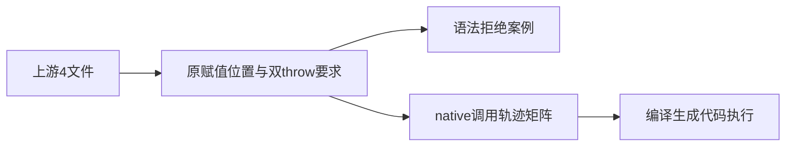
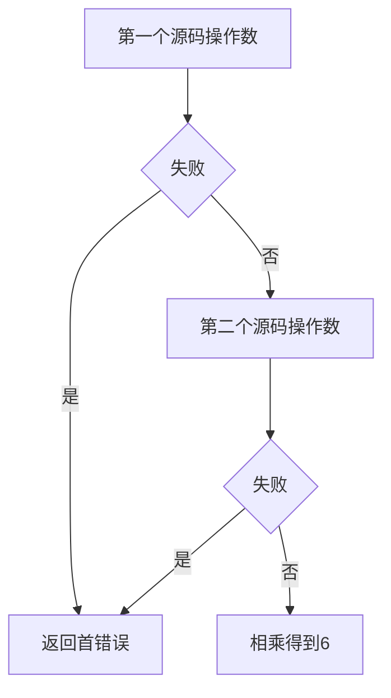

# Test262乘法求值顺序验证

## IDEA

- Intent：对齐A2.4四文件涉及的左右求值、首错误传播与赋值表达式边界。
- Data：锁定上游四份完整原文；已有真实native探针left=2、right=3及轨迹断言。
- Edges：fallible宿主错误适配throw；ZX赋值表达式解析拒绝不能冒充JS隐式全局或运行ReferenceError。乘法结果可交换，顺序必须用轨迹证据。
- Answer：16个调用轨迹案例、4个赋值语法案例、四条上游记录、执行日志与草稿。





## 逐文件要求

- T1：原x=0，左赋值再读得到1，先读再右赋值得到0。ZX保留两种表达式位置，断言等号处syntax拒绝，不宣称赋值副作用等价。
- T2：x/y均抛错时必须得到x错误。采用两个独立fallible探针；扩展正反源码顺序、直接乘法/先绑定、单/双失败与成功对照。
- T3：未声明x在赋值前读取应抛ReferenceError。ZX先解析拒绝赋值表达式，不冒充运行名称错误。
- T4：非严格隐式全局y赋值后读取得到1。ZX没有隐式全局，保留原表达式语法拒绝。

## 结果

新增20个登记案例：16个运行轨迹、4个赋值语法拒绝。新增四条adapted记录。执行：

```sh
cd packages/test
zig build test-frontend test-evaluation-order --summary all
```

专项42/42步骤、4,512/4,512测试通过，日志 `/tmp/zxc-multiplication-order.log`。包级TypeScript检查、目录审计、生成器--check、diff及草稿一致性通过。

独立审阅脚本 `乘法顺序审阅/审阅校验.py` 核验四份上游SHA-256，16个布尔组合无重复，按事件列表模拟停止位置/首错误并对照全部预期，核查四个赋值表达式和等号字节跨度。日志 `/tmp/zxc-multiplication-order-review.log`。

目录61,820：前端3,715、普通运行46,163、调用轨迹796、安全464、RX模块10,446、Store236。上游419/53,597（276 adapted、102 equivalent、41 excluded），未审阅53,178，唯一关联2,322。日志 `/tmp/zxc-multiplication-order-audit.log`。

草稿位于 `docs/2026-10-04/乘法顺序测试草稿/`，包含生成器、前端目录、运行目录、ZX源码、审阅记录5份。没有生产源码修改或新缺陷通知。

## 自我批判

乘法交换律使返回值无法单独证明操作数顺序，所以必须保留探针轨迹和首错误。先绑定版本作为对照，不取代直接操作数版本。宿主LeftFailure/RightFailure不是JS抛出的任意字符串，也没有实现try/catch；这些差异已写入adapted理由。赋值解析拒绝更不能视为上游副作用与ReferenceError通过。

本轮只跑前端和调用轨迹，不代表完整根测试；最新完整根仍阶段122，阶段125四个legacy失败未回归。

