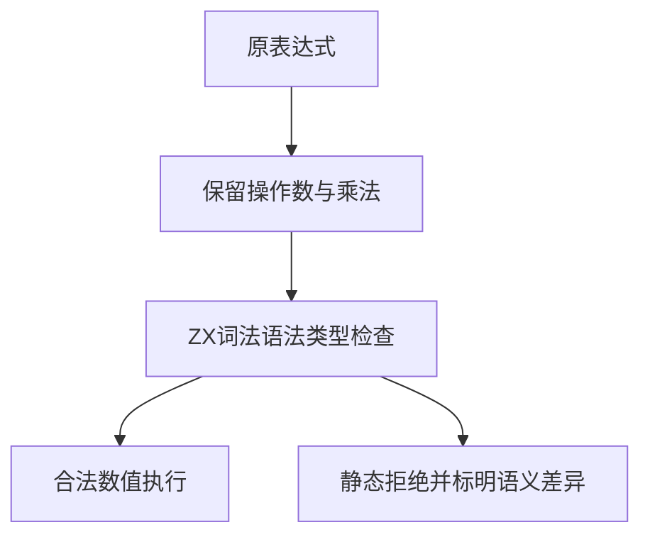

# Test262乘法空白与转换边界

## IDEA

- Intent：推进乘法目录尚未审阅的A1空白及A3十四个转换文件，逐项保留原表达式并标明ZX差异。
- Data：锁定Test262 revision 7ab7fafa0003f73fc85c1b95d88094d33f7eb8bd，15份原文与SHA-256，既有减法同职责生成器。
- Edges：ZX没有ECMAScript动态拆箱和隐式ToNumber；静态拒绝是适配边界，不宣称原JS结果等价。Unicode空白差异明确登记。
- Answer：72个转换前端案例、60个空白前端案例、54个空白执行案例；15条逐文件审阅、复现脚本、日志与草稿。先核对全部原始表达式，再登记结论。




## 执行结果

新增186个登记案例：132前端（转换72、空白60）、54执行。A3覆盖全部14文件72项原表达式；A1保留十组原空白双侧位置，并扩展单侧位置及混合类型。

| 上游组 | 断言数 | ZX适配行为 |
| --- | ---: | --- |
| A1 | 10 | TAB/VT/FF/SP/LF/CR接受；NBSP/LS/PS及组合串在首个非ASCII字节拒绝 |
| A3 T1.1–T1.5 | 22 | Boolean/Number/String原始值与包装对象、null/undefined、对象/函数 |
| A3 T2.1–T2.9 | 50 | 各类跨类型操作数，保持原左右顺序 |

数值1*1通过并关联本轮真实运行得到1；包装new与function表达式syntax拒绝，非数值原始值type_mismatch，undefined按名称错误处理。空白运行额外输入0、1、3，对应乘1结果0、1、3。

复现审阅：

```sh
python3 docs/2026-10-04/乘法边界审阅/审阅校验.py /tmp/zxc-test262-reference/test262-7ab7fafa0003f73fc85c1b95d88094d33f7eb8bd
```

脚本逐文件SHA-256匹配索引，提取并完整核对所有CHECK/if表达式数量及顺序；日志 `/tmp/zxc-multiplication-boundary-review.log`。已保存15条adapted记录，明确Unicode空白与动态转换差异。

执行 `zig build test-frontend test-runtime --summary all`：1,001/1,001步骤、49,874/49,874测试通过，日志 `/tmp/zxc-multiplication-boundary.log`。该范围不包含阶段125的已知失败，不能宣称完整根全绿。

目录审计61,800：前端3,711、普通运行46,163、调用轨迹780、安全464、RX模块10,446、Store236。上游415/53,597已审阅（272 adapted、102 equivalent、41 excluded），剩余53,182，唯一关联2,302。日志 `/tmp/zxc-multiplication-boundary-audit.log`。生成器--check、包级TS检查、diff和草稿一致性通过，无生产修改。

首次审计发现复用审阅模板时遗留减法运行关联与预期值，已改为实际乘法案例和预期1；修正后完整审计通过，不能以模板替代逐项核对。

## 自我批判

本轮没有实现Unicode空白、隐式ToNumber或动态包装对象。adapted记录说明ZX拒绝边界，不是上游原JS断言执行通过。乘1运行用于词法位置隔离，不能替代既有乘法数值边界测试。组合空白串被首个NBSP拒绝，不证明之后LS/PS被扫描；它们另有独立案例。

生成器与两组目录和审阅记录的草稿位于 `docs/2026-10-04/乘法边界测试草稿/`。最新完整根仍阶段122，阶段125四个legacy失败未回归。

