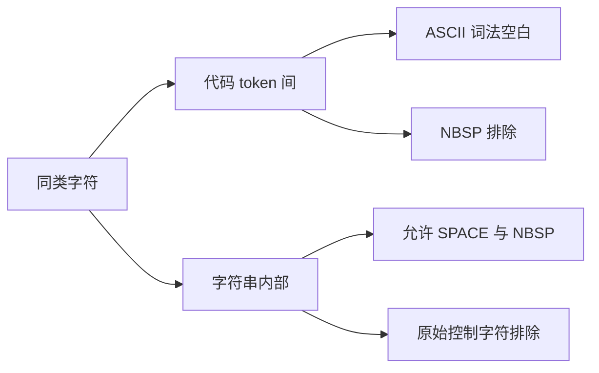
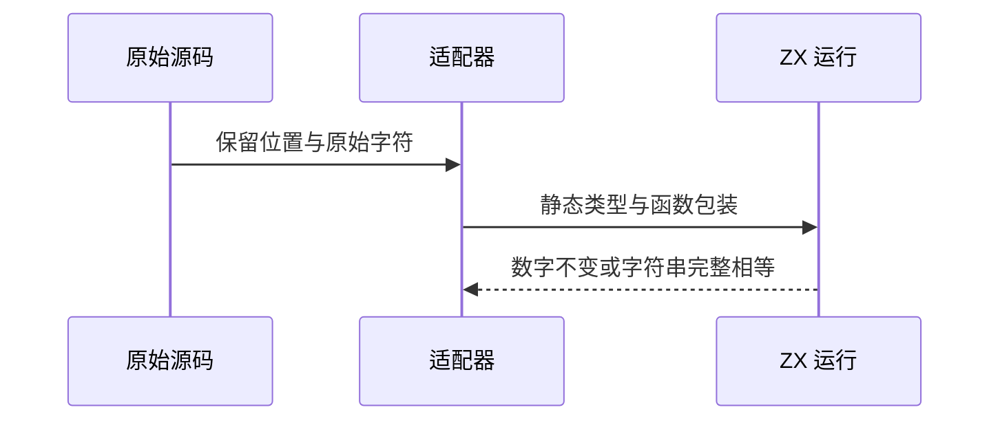

# Test262 代码空白与字符串位置验证

## Intent：最终目标

阶段三百一十八：验证字符所在位置如何影响词法行为，不将注释内允许字符扩展为任意位置允许。

## Data：可用证据

读取10个 between/string 原文。FF、HT、VT、SPACE 在代码 token 间可用；SPACE、NBSP 在双引号字符串内可用。代码区 NBSP 与字符串内原始 FF、HT、VT 不符合 ZX 当前规则。

## Edges：边界与限制

4个代码空白文件将 var 改 const、移除语句分号，并将初始化数字改运行输入，保持其余原始空白序列。每个包含原始期望值和额外输入。字符串文件只将原文 eval 解码后的单引号定界改双引号，不替换内部实际字符，不声称支持 eval。

## Answer：交付格式与成功标准

6个 adapted、4个 excluded；4个数字模块各4输入，3个字符串片段各1断言，共19项。需原文核验、生成器重复性、矩阵和执行专项通过。

## 自我复核

数据来自原文实际源码而非描述文字；保留 TAB 原文中 var 与 x 之间的两个普通空格。未支持项目排除，不通过转义控制字符改变原用例。

## 实际结果

运行 `zig build test-whitespace-positions --summary all`：37/37 构建步骤、19/19 测试通过。10 原文哈希和正文核验通过，官方 harness 普通/严格模式20次执行通过。生成器重复性、矩阵、格式和本次 diff 空白检查通过。

6 adapted、4 excluded；JSONL64848（runtime47371），已审阅1769=618 adapted+103 equivalent+1048 excluded，未审阅51828，关联4710。未修改生产代码、未发现实现缺陷、未发实现消息；未重跑完整根回归。
