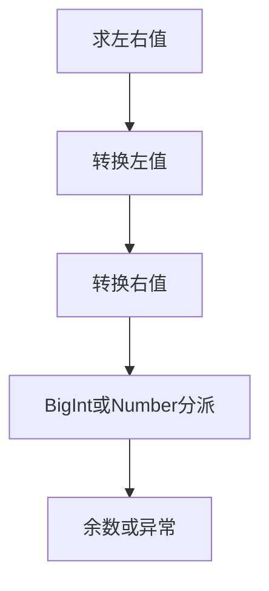

# Test262余数动态协议缺口审阅

## IDEA

- Intent：逐项审阅余数剩余九份动态协议原文，明确真实兼容性缺口。
- Data：锁定Test262原文、256个BigInt算术断言、ZX数值契约的固定宽度限制。
- Edges：excluded表示当前未支持，不能计为通过；不以词法拒绝或静态调用替代动态转换。
- Answer：九条来源审阅、独立哈希/算术校验、能力缺口与审计结果。

## 缺口

A2.2的八项断言要求valueOf优先、toString回退、对象返回与异常传播；A2.3要求左侧转换先抛错。order-of-evaluation的六组轨迹依次要求1、12、123、1234、123、1234，不能用普通函数调用顺序替代全部转换阶段。

BigInt混合类型20项、Symbol错误10项、包装值8项、ToPrimitive成功20项和异常24项、除零4项，以及算术256项均逐项审阅。算术输入16个值形成完整有序对，最小值-18364758544493064720超出i64。ZX当前数值契约明确固定宽度整数，不具备任意精度、Symbol或动态拆箱协议，因此九份文件均标excluded，保留为未实现能力。

## 结果

九份来源SHA-256、全部256个AST断言、16×16有序对、独立整数商/余数模型、90个符号差异及协议断言数量与六组轨迹均检查通过；脚本位于 `余数动态协议审阅/原文校验.py`，日志 `/tmp/zxc-modulus-protocol-review.log`。算术原文件较长，使用AST全量提取与正文规则交叉核对，没有因终端截断而省略中间断言。

审计通过：目录62,251不变；上游494/53,597（323 adapted、103 equivalent、68 excluded），未审阅53,103，唯一关联2,757。日志 `/tmp/zxc-modulus-protocol-audit.log`。本轮新增九条excluded，未增加任何ZX通过案例。余数目录审阅状态统计为：{'adapted': 23, 'excluded': 9, 'equivalent': 8}。

同时修正modulus_conversion审阅理由遗留的“null - undefined”为“null % undefined”，仅文字错误；生成案例未改变。本轮没有源码或测试逻辑修改，因此不重复执行无关构建；diff及审阅记录草稿一致性通过。

## 自我批判

余数目录逐文件审阅完整，不等于余数的全部JS语义兼容。excluded是缺口登记，不能算通过率分子；adapted中的静态拒绝也不能证明原动态语义成立。原始目标仍包含对齐Test262，这些未实现协议仍是未完成要求，不因审阅完成消失。现有固定宽度契约与JS任意精度/动态转换存在语义差异，不能在本轮审阅中擅自扩张语言架构或把这些缺口隐藏到数量统计中。
