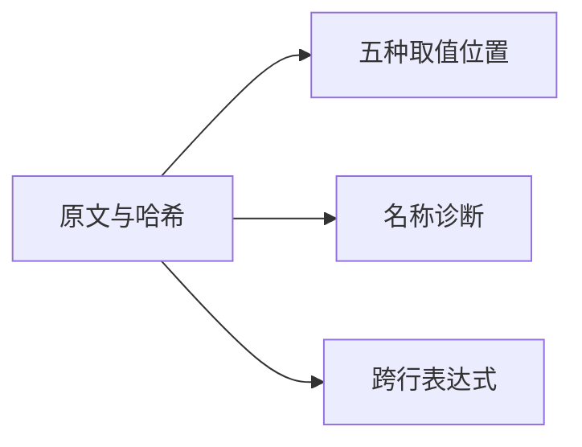
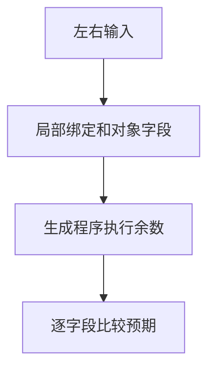

# Test262余数取值与跨行验证

## IDEA

- Intent：按原操作数对齐余数的五种取值位置、未声明左右操作数及跨行左结合。
- Data：锁定版本的A2.1_T1—T3和line-terminator四份完整原文；已有除法名称测试布局。
- Edges：对象使用静态字段；ReferenceError适配为分析期name诊断。新增案例不声称动态对象或异常阶段兼容。
- Answer：四条逐文件审阅、九个案例、生成一致性及前端/运行验证；保留草稿和结果。

## 执行计划

1. 保留原始1%2与18%7%3，扩展不同左右值，避免复制除法的相同输入。
2. 登记生成器、suite和四条来源审阅，独立核验哈希、原断言与目录关系。
3. 运行验证并记录边界、自我批判。

## 结果

新增9个案例（4前端、5运行）和4条adapted来源记录。`zig build test-frontend test-runtime --summary all`退出0，1,029/1,029步骤、50,277/50,277测试通过。日志 `/tmp/zxc-modulus-names.log`。

目录审计62,251：3,995前端、46,282普通运行、828轨迹、464安全、10,446模块、236 Store；上游484/53,597（323 adapted、102 equivalent、59 excluded），未审阅53,113，唯一关联2,753。审计和TS日志分别 `/tmp/zxc-modulus-names-audit.log`、`/tmp/zxc-modulus-names-typecheck.log`。

独立校验四份原文哈希、五个原断言、四组手算数值、跨行序列及四条名称案例，通过日志 `/tmp/zxc-modulus-names-review.log`。初版校验脚本使用当前Python不支持的zip(strict=True)，已改为先验证长度再zip，没有调整测试预期。

生成器已接入根--check列表；生成一致性、Zig格式、diff与七份草稿检查通过。代码草稿保存在 `余数取值测试草稿/`，本轮没有生产实现修改或新缺陷通知。

## 自我批判

静态对象字段只覆盖原五种取值位置，不证明JS的动态对象GetValue语义。运行期ReferenceError被分析期name诊断替代，仍是适配。新增有符号整数值避免JSON丢失负零；IEEE负零/NaN由既有位模式测试承担。本轮运行全部普通前端和运行目录，但没有重新执行完整根；最新完整执行阶段145仍有4个legacy失败，最后完整全绿阶段122。上游未审阅文件仍很多，不能以62,251个登记案例宣称Test262全部对齐。
