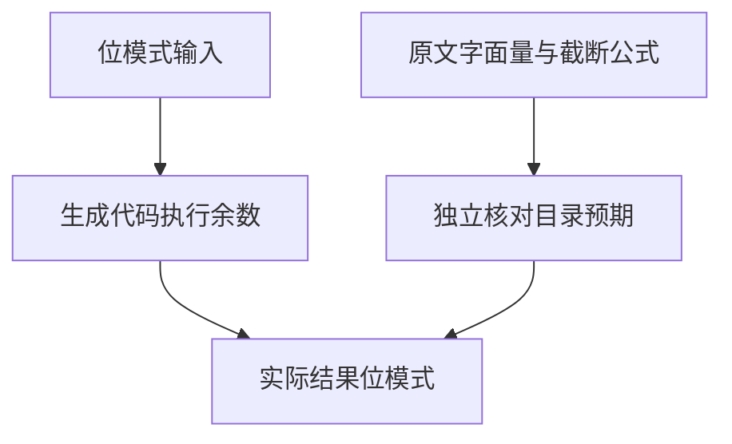

# Test262余数浮点断言核验

## IDEA

- Intent：完整对齐A4_T7的八个断言，避免只核对四个字面量结果。
- Data：锁定原文的四个数值断言、四个截断恒等式，以及现有f64位模式执行目录。
- Edges：使用已有案例而不重复登记；不声称ZX支持Math.floor/ceil，也不把有限四组恒等式推广到所有浮点输入。
- Answer：独立原文校验、逐项位模式关联、新增一条equivalent审阅与浮点专项结果。

## 执行计划

逐项解析八个CHECK，验证全部输入、字面量和恒等式预期，关联现有精确位模式；重跑浮点专项和目录审计。仅修改来源审阅和文档。

## 结果

八项原断言已全部独立核对，分别关联四个已有f64执行案例。正数结果位模式3fc9999999999998，负数结果bfc9999999999998，与原文±0.19999999999999996一致。校验同时检查输入位模式、原文哈希、八个CHECK顺序及四条公式，不仅检查目录行存在。

`zig build test-floating --summary all`退出0，185/185步骤、25,236/25,236测试通过，日志 `/tmp/zxc-modulus-floating.log`。原文校验和审计日志分别 `/tmp/zxc-modulus-floating-review.log`、`/tmp/zxc-modulus-floating-audit.log`，diff检查通过。本轮只增加来源关联，没有源码和生成器修改；审阅记录草稿位于 `余数浮点审阅/来源记录.jsonl`。

目录仍62,251；上游485/53,597（323 adapted、103 equivalent、59 excluded），未审阅53,112，唯一关联2,757。未增加重复案例。本轮没有新缺陷通知。实现会话最新进展正在接入后端协议的构建流程，后续需要针对缓存定位、依赖路径与发布前输入复核补测试。

## 自我批判

四个恒等式由独立宿主计算转换成精确结果，再与实际ZX生成程序输出的位模式核对；不意味着ZX执行了原文Math.floor/ceil函数。它们只验证原文给定四组输入；浮点除法溢出、相消和舍入可能使公式在其他输入失效，不能将公式直接当作一般余数实现。原始JS文件没有由ZX直接执行。

最新完整根执行仍阶段145，含4个已知legacy失败；本轮浮点专项通过不能替代根回归，也不能表示完整Test262已经对齐。
