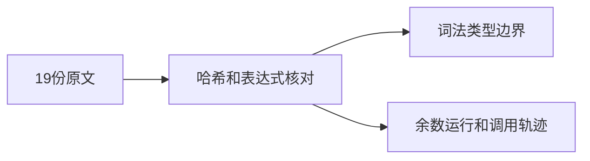
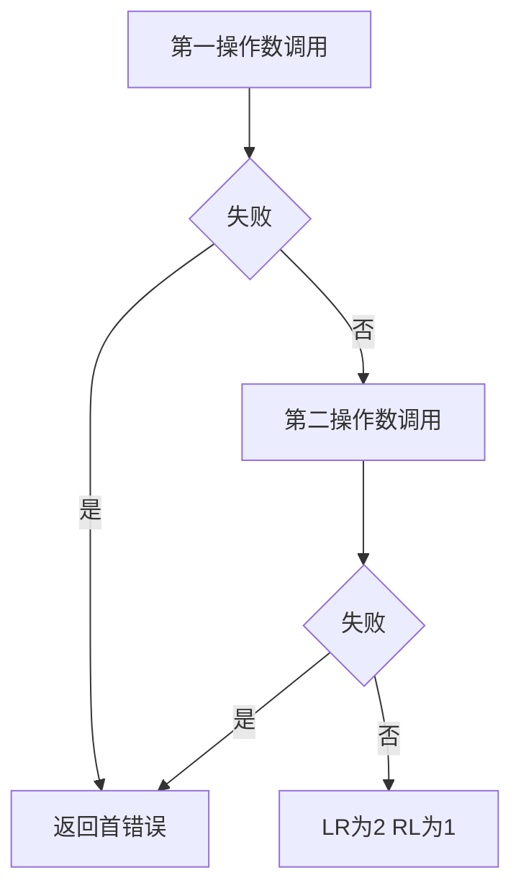

# Test262余数空白转换与顺序验证

## IDEA

- Intent：逐项对齐modulus目录A1、A3和A2.4共19个文件，保留余数特有结果及赋值操作数。
- Data：锁定原文10组空白、72项转换、4份顺序断言；现有IEEE余数数值矩阵与真实调用探针。
- Edges：不把Unicode空白、动态转换、赋值解析拒绝视为原JS兼容；本轮词法场景不替代已有余数符号/舍入测试。
- Answer：206个案例（136前端、54普通运行、16轨迹）、19条适配、独立原文校验及日志草稿。

## 原文差异

A1全部1%1预期为0。A3的1%null和null%null是NaN而不是除法的正无穷，原表达式逐项保留。A2.4_T1第二项为x初始1、x%(x=2)预期1，不能复制除法的初始0及赋值1；本轮按原操作数保留并验证等号语法拒绝。其他未声明与隐式全局要求仍明确是阶段不同的适配。

## 结果

新增206个案例：136前端、54普通运行、16调用轨迹；新增19条adapted记录。执行 `zig build test-frontend test-runtime test-evaluation-order --summary all`，1,066/1,066步骤、51,097/51,097测试通过，日志 `/tmp/zxc-modulus-boundary.log`。

两份独立校验脚本保存在 `余数边界审阅/`，核验19个上游文件SHA-256、全部72个转换表达式、10项空白序列、16个轨迹组合与4个赋值表达式/精确等号跨度；额外检查right_assignment的x初始值1。日志 `/tmp/zxc-modulus-expression-review.log`、`/tmp/zxc-modulus-order-review.log`。复用顺序校验脚本时曾误将Path连接斜杠改为%，脚本立即报类型错误，已只恢复路径操作并重新通过；没有改变算术预期来绕过失败。

目录审计62,242：前端3,991、普通运行46,277、调用轨迹828、安全464、RX模块10,446、Store236。上游480/53,597（319 adapted、102 equivalent、59 excluded），未审阅53,117，唯一关联2,744。日志 `/tmp/zxc-modulus-boundary-audit.log`。

三个生成器已同步接入根--check列表，包级TS、生成一致性、Zig格式、diff及13份草稿检查通过。草稿位于 `docs/2026-10-04/余数边界测试草稿/`。没有生产实现修改或新缺陷通知。

## 自我批判

%1空白运行用来隔离词法行为，所有整数输入结果为0，不能证明一般余数计算；2%3=2与3%2=1的调用场景同时检查数值和顺序，其他符号/浮点边界由既有专门矩阵承担。原转换的NaN和运行期异常在ZX被静态拒绝，不是原JS断言通过。源表达式修改保留原赋值数字，但解析拒绝不证明副作用语义。

最新完整根执行仍为阶段145（4个已知legacy失败），最后完整全绿为阶段122；本轮三个专项通过不覆盖这些失败，也不完成全部Test262目标。

